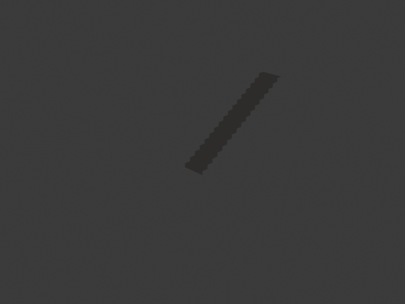
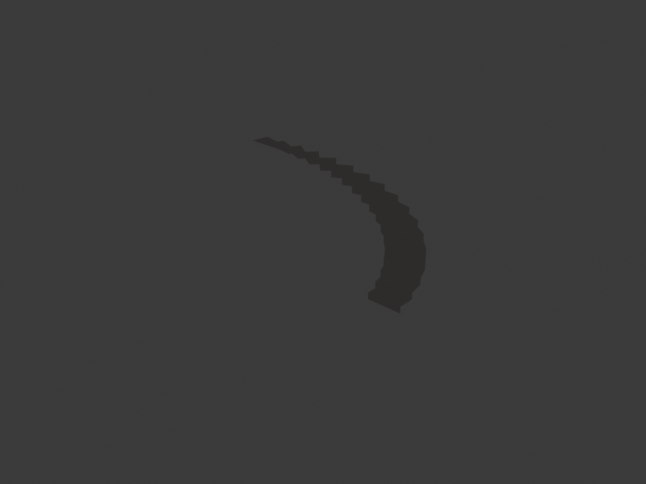

# Circulation

Circulation elements enable movement between and within levels. Stairs connect floors vertically, ramps provide accessible slopes, landings create rest platforms, and railings add safety barriers.

## Stair

A straight stair generates a flight of steps from a base point, climbing in a given direction between two levels. The number of steps is computed automatically from the level heights and family parameters.

### Signature

```julia
stair(base_point::Loc=u0(),
      direction::Vec=vy(1),
      bottom_level::Level=default_level(),
      top_level::Level=upper_level(bottom_level),
      family::StairFamily=default_stair_family())
```

### StairFamily Parameters

| Parameter | Default | Description |
|-----------|---------|-------------|
| `width` | `1.0` | Stair width |
| `riser_height` | `0.18` | Height of each riser |
| `tread_depth` | `0.28` | Depth of each tread |
| `thickness` | `0.15` | Stringer/slab thickness under treads |
| `has_risers` | `true` | Whether to generate riser faces |
| `tread_material` | `material_concrete` | Tread surface material |
| `riser_material` | `material_concrete` | Riser face material |
| `stringer_material` | `material_concrete` | Structural support material |

The number of risers is `ceil(Int, height / riser_height)` where `height = top_level.height - bottom_level.height`.

### Examples



```julia
ground = level(0)
first_floor = level(3.0)

# Basic stair climbing in the Y direction
stair(xy(0, 0), vy(1), ground, first_floor)

# Stair climbing in the X direction
stair(xy(0, 5), vx(1), ground, first_floor)

# Wide stair with shallow risers
wide_stair = stair_family(width=1.5, riser_height=0.15, tread_depth=0.30)
stair(xy(0, 0), vy(1), ground, first_floor, wide_stair)

# Open-riser stair
open_stair = stair_family(has_risers=false)
stair(xy(0, 0), vy(1), ground, first_floor, open_stair)
```

## Spiral Stair

A spiral stair generates pie-shaped treads arranged around a central column, spiraling from the bottom level to the top level.

### Signature

```julia
spiral_stair(center::Loc=u0(),
             radius::Real=2.0,
             start_angle::Real=0,
             included_angle::Real=2*pi,
             clockwise::Bool=true,
             bottom_level::Level=default_level(),
             top_level::Level=upper_level(bottom_level),
             family::StairFamily=default_stair_family())
```

### Parameters

| Parameter | Default | Description |
|-----------|---------|-------------|
| `center` | `u0()` | Center point of the spiral |
| `radius` | `2.0` | Outer radius of treads |
| `start_angle` | `0` | Starting angle (radians) |
| `included_angle` | `2*pi` | Total rotation angle (radians) |
| `clockwise` | `true` | Rotation direction |

The `family` parameter is the same `StairFamily` used by straight stairs. The `width` parameter of the family is unused — the tread width is determined by `radius`.

### Examples

| Full-turn spiral | Half-turn spiral |
|:---:|:---:|
|  |  |

```julia
ground = level(0)
first_floor = level(3.0)

# Full-turn spiral stair
spiral_stair(xy(5, 5), 1.5, 0, 2*pi, true, ground, first_floor)

# Half-turn spiral stair, counterclockwise
spiral_stair(xy(5, 5), 2.0, 0, pi, false, ground, first_floor)

# Spiral with custom start angle
spiral_stair(xy(5, 5), 1.8, pi/4, 2*pi, true, ground, first_floor)
```

## Stair Landing

A stair landing is a horizontal platform between flights of stairs. It is structurally similar to a slab but uses its own family to distinguish materials and thickness.

### Signature

```julia
stair_landing(region::Region=rectangular_path(),
              level::Level=default_level(),
              family::StairLandingFamily=default_stair_landing_family())
```

### StairLandingFamily Parameters

| Parameter | Default | Description |
|-----------|---------|-------------|
| `thickness` | `0.2` | Landing thickness |
| `top_material` | `material_concrete` | Top surface material |
| `bottom_material` | `material_concrete` | Bottom surface material |
| `side_material` | `material_concrete` | Edge material |

### Examples

```julia
mid_level = level(1.5)

# Rectangular landing between stair flights
stair_landing(rectangular_path(xy(0, 3), 2.5, 1.2), mid_level)

# Custom landing
thin_landing = stair_landing_family(thickness=0.15)
stair_landing(rectangular_path(xy(0, 3), 2.5, 1.2), mid_level, thin_landing)
```

## Ramp

A ramp is an inclined surface that provides accessible transitions between levels. It follows a path and slopes uniformly from the bottom level to the top level.

### Signature

```julia
# Path form
ramp(path::Path=open_polygonal_path([u0(), ux()]),
     bottom_level::Level=default_level(),
     top_level::Level=upper_level(bottom_level),
     family::RampFamily=default_ramp_family())

# Two-point convenience form
ramp(p0::Loc, p1::Loc;
     bottom_level::Level=default_level(),
     top_level::Level=upper_level(bottom_level),
     family::RampFamily=default_ramp_family())
```

### RampFamily Parameters

| Parameter | Default | Description |
|-----------|---------|-------------|
| `width` | `1.2` | Ramp width |
| `thickness` | `0.2` | Structural thickness |
| `bottom_material` | `material_concrete` | Underside material |
| `top_material` | `material_concrete` | Walking surface material |
| `side_material` | `material_concrete` | Edge material |

### Examples

```julia
ground = level(0)
mezzanine = level(1.5)

# Simple straight ramp
ramp(xy(0, 0), xy(0, 12),
     bottom_level=ground, top_level=mezzanine)

# Wider ADA-compliant ramp
accessible_ramp = ramp_family(width=1.5)
ramp(xy(0, 0), xy(0, 18),
     bottom_level=ground, top_level=mezzanine,
     family=accessible_ramp)

# L-shaped ramp with a turn
ramp(open_polygonal_path([xy(0, 0), xy(0, 6), xy(3, 6)]),
     ground, mezzanine)
```

## Railing

A railing is a safety barrier along a path. It consists of a swept rail profile and evenly spaced posts. Railings can optionally be attached to a host element (e.g., a stair or slab).

### Signature

```julia
railing(path::Path=open_polygonal_path([u0(), ux()]),
        level::Level=default_level(),
        host::Union{BIMShape, Nothing}=nothing,
        family::RailingFamily=default_railing_family())
```

### RailingFamily Parameters

| Parameter | Default | Description |
|-----------|---------|-------------|
| `height` | `0.9` | Railing height above path |
| `post_spacing` | `1.0` | Distance between posts |
| `material` | `material_metal` | Material for rail and posts |

### Examples

```julia
ground = level(0)

# Railing along a straight edge
railing(open_polygonal_path([xy(0, 0), xy(10, 0)]), ground)

# Railing around a balcony
railing(open_polygonal_path([
  xy(0, 6), xy(8, 6), xy(8, 0)]), level(3.0))

# Railing with custom height and spacing
short_rail = railing_family(height=1.1, post_spacing=1.5)
railing(open_polygonal_path([xy(0, 0), xy(10, 0)]),
        ground, nothing, short_rail)

# Railing attached to a stair
s = stair(xy(0, 0), vy(1), level(0), level(3.0))
railing(open_polygonal_path([xy(0, 0), xyz(0, 5, 3.0)]),
        level(0), s)
```

## Complete Stairwell Example

A stairwell with two flights connected by a landing, with railings on both sides:

```julia
ground = level(0)
mid_level = level(1.5)
first_floor = level(3.0)

# First flight: ground to mid-landing, going in Y direction
stair(xy(0, 0), vy(1), ground, mid_level)

# Landing platform at mid-level
stair_landing(rectangular_path(xy(-0.25, 4.5), 2.5, 1.5), mid_level)

# Second flight: mid-landing to first floor, going in -Y direction
stair(xy(2.0, 6.0), vy(-1), mid_level, first_floor)

# Railings along both flights (these paths span different Z heights)
railing(open_polygonal_path([xy(0, 0), xyz(0, 4.5, 1.5)]), ground)
railing(open_polygonal_path([xy(2.0, 0), xyz(2.0, 4.5, 1.5)]), ground)

railing(open_polygonal_path([xyz(0, 6.0, 1.5), xyz(0, 1.5, 3.0)]), mid_level)
railing(open_polygonal_path([xyz(2.0, 6.0, 1.5), xyz(2.0, 1.5, 3.0)]), mid_level)

# Landing railings
railing(open_polygonal_path([xy(-0.25, 4.5), xy(-0.25, 6.0)]), mid_level)
railing(open_polygonal_path([xy(2.25, 4.5), xy(2.25, 6.0)]), mid_level)
```
