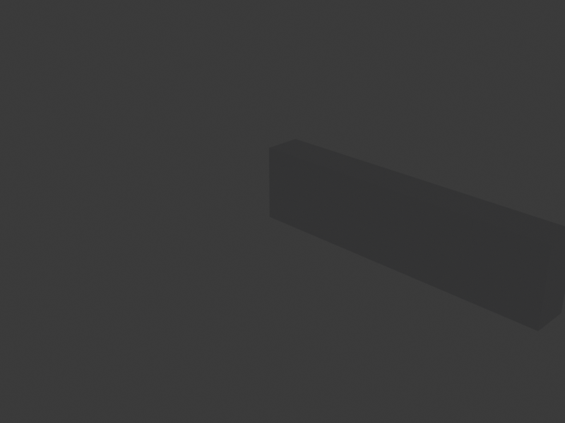
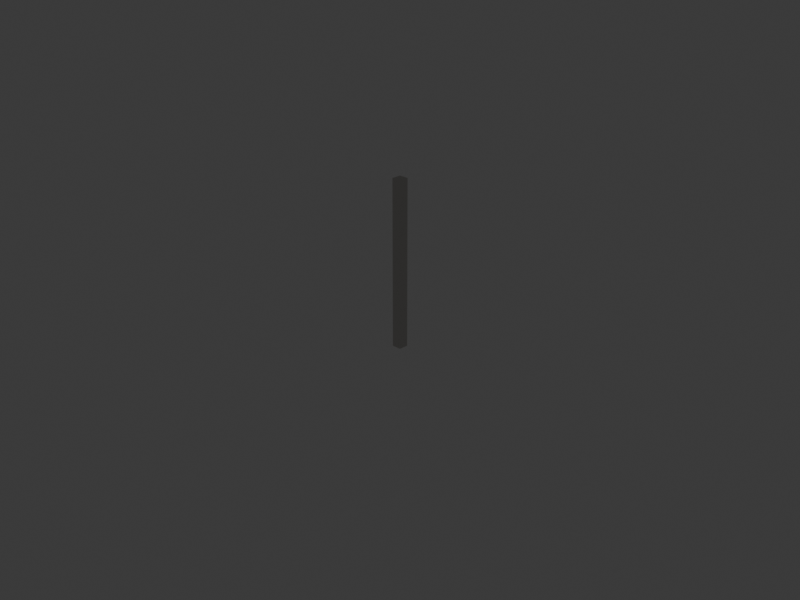
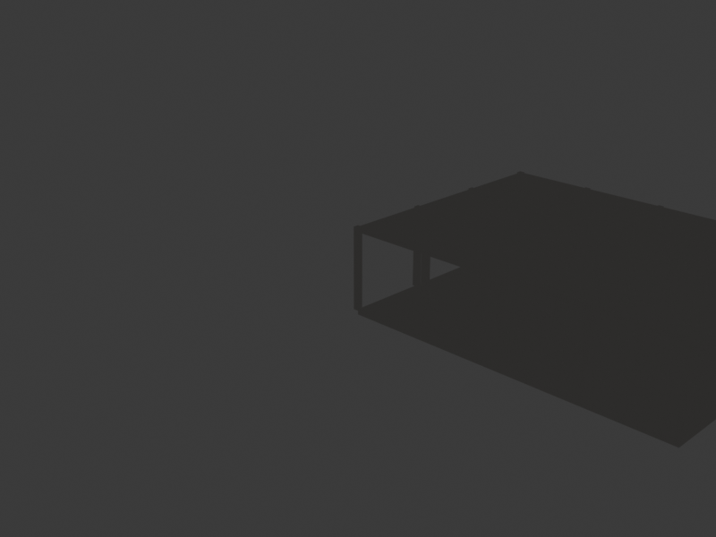
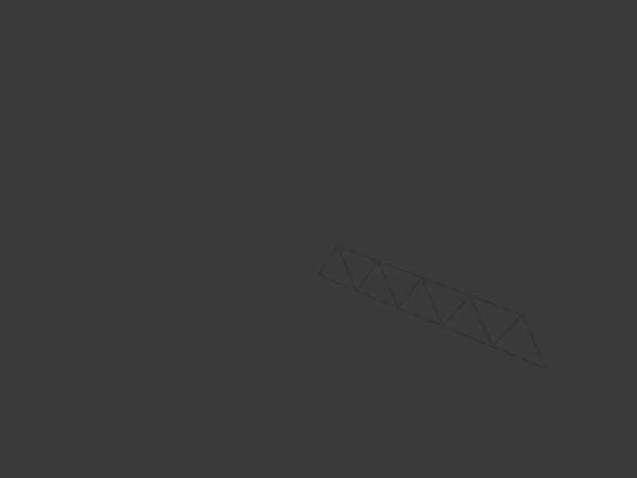

# Structural Elements

Structural elements carry loads through a building. Beams span horizontally, columns stand vertically, and trusses form lightweight frameworks of nodes and bars.

## Beam

A beam is a horizontal structural member defined by a cross-section profile extruded along its length. By default, the profile is **top-aligned** — the beam hangs below its reference point.

### Signature

```julia
# Single-point form: beam from cb downward with length h
beam(cb::Loc=u0(), h::Real=1, angle::Real=0,
     family::BeamFamily=default_beam_family())

# Two-point form: beam from cb to ct
beam(cb::Loc, ct::Loc, angle::Real=0,
     family::BeamFamily=default_beam_family())
```

### BeamFamily Parameters

| Parameter | Default | Description |
|-----------|---------|-------------|
| `profile` | `top_aligned_rectangular_profile(1, 2)` | Cross-section path |
| `material` | `material_metal` | Beam material |

The `profile` is a `ClosedPath` that defines the cross-section shape. The beam is extruded along the vector from `cb` for length `h` (or from `cb` to `ct`).

### Examples



```julia
# Simple beam spanning 6 meters
beam(xyz(0, 0, 3), xyz(6, 0, 3))

# Beam with custom profile
steel_beam = beam_family(
  profile=top_aligned_rectangular_profile(0.15, 0.30))
beam(xyz(0, 0, 3.5), xyz(8, 0, 3.5), 0, steel_beam)

# Rotated beam (angle in radians)
beam(xyz(0, 0, 3), xyz(6, 0, 3), pi/4)
```

## Column

A column is a vertical structural member that spans between two levels. It uses the same `ColumnFamily` as `free_column` but is level-aware.

### Signature

```julia
column(cb::Loc=u0(), angle::Real=0,
       bottom_level::Level=default_level(),
       top_level::Level=upper_level(bottom_level),
       family::ColumnFamily=default_column_family())
```

### ColumnFamily Parameters

| Parameter | Default | Description |
|-----------|---------|-------------|
| `profile` | `rectangular_profile(0.2, 0.2)` | Cross-section path (centered) |
| `material` | `material_concrete` | Column material |

### Examples

| Single column | Grid of columns |
|:---:|:---:|
|  |  |

```julia
ground = level(0)
first_floor = level(3.5)

# Column at a specific location
column(xy(5, 5), 0, ground, first_floor)

# Circular column profile
round_col = column_family(
  profile=circular_profile(0.15))
column(xy(5, 5), 0, ground, first_floor, round_col)
```

## Free Column

A free column is identical to a column but uses an explicit height instead of levels. This is useful when columns don't align with building levels.

### Signature

```julia
# Single-point form
free_column(cb::Loc=u0(), h::Real=1, angle::Real=0,
            family::ColumnFamily=default_column_family())

# Two-point form
free_column(cb::Loc, ct::Loc, angle::Real=0,
            family::ColumnFamily=default_column_family())
```

### Examples

```julia
# 4-meter tall column
free_column(xy(0, 0), 4.0)

# Column defined by two endpoints
free_column(xy(0, 0), xyz(0, 0, 3.5))
```

## Trusses

Trusses are lightweight structural frameworks composed of **nodes** (joints) and **bars** (members). KhepriBase provides a full truss modeling and analysis workflow.

### Truss Node

```julia
truss_node(p::Loc=u0(),
           family::TrussNodeFamily=default_truss_node_family())
```

#### TrussNodeFamily Parameters

| Parameter | Default | Description |
|-----------|---------|-------------|
| `radius` | `0.03` | Visual sphere radius |
| `support` | `false` | Support conditions (`false` or `TrussNodeSupport`) |
| `material` | `material_metal` | Node material |

#### Support Conditions

Use `truss_node_support` to define boundary conditions:

```julia
# Fixed support (all translations constrained)
fixed = truss_node_family_element(
  default_truss_node_family(),
  support=truss_node_support(ux=true, uy=true, uz=true))

# Or use the predefined families
free_truss_node_family    # no constraints
fixed_truss_node_family   # ux, uy, uz constrained
```

### Truss Bar

```julia
truss_bar(p0::Loc=u0(), p1::Loc=u0(), angle::Real=0,
          family::TrussBarFamily=default_truss_bar_family())
```

#### TrussBarFamily Parameters

| Parameter | Default | Description |
|-----------|---------|-------------|
| `radius` | `0.02` | Visual cylinder radius |
| `inner_radius` | `0` | Inner radius (for hollow sections) |
| `material` | `material_metal` | Bar material |

### Bulk Constructors

```julia
# Create multiple nodes at once
nodes = truss_nodes([xy(0,0), xy(1,0), xy(2,0)])

# Create bars connecting pairs of points
bars = truss_bars(
  [xy(0,0), xy(1,0)],   # start points
  [xy(1,0), xy(2,0)])   # end points
```

### Node and Bar Merging

Coincident nodes (within `truss_node_coincidence_tolerance()`, default `1e-6` m) are automatically merged. This can be controlled:

```julia
merge_coincident_truss_nodes(false)         # disable merging (errors on coincidence)
truss_node_coincidence_tolerance(1e-4)      # change tolerance
```

### Analysis Workflow

A Warren truss with bottom chord nodes and diagonals / verticals:



```julia
# 1. Build the truss
n1 = truss_node(xy(0, 0), fixed_truss_node_family)
n2 = truss_node(xy(3, 0), fixed_truss_node_family)
n3 = truss_node(xyz(1.5, 0, 1.5))
truss_bar(n1.p, n3.p)
truss_bar(n3.p, n2.p)
truss_bar(n1.p, n2.p)

# 2. Run analysis (requires an analysis backend like Frame3DD)
results = truss_analysis(load=vz(-1e5))

# 3. Visualize deformation
view_truss_deformation(results, factor=100)
max_displacement(results)
```

## Column Grid Example

A regular grid of columns supporting a floor:

```julia
ground = level(0)
first_floor = level(4.0)

# 4x6 grid at 5m spacing
for x in 0:5:15, y in 0:5:25
  column(xy(x, y), 0, ground, first_floor)
end

# Floor slab above
slab(rectangular_path(xy(0, 0), 15, 25), first_floor)
```
