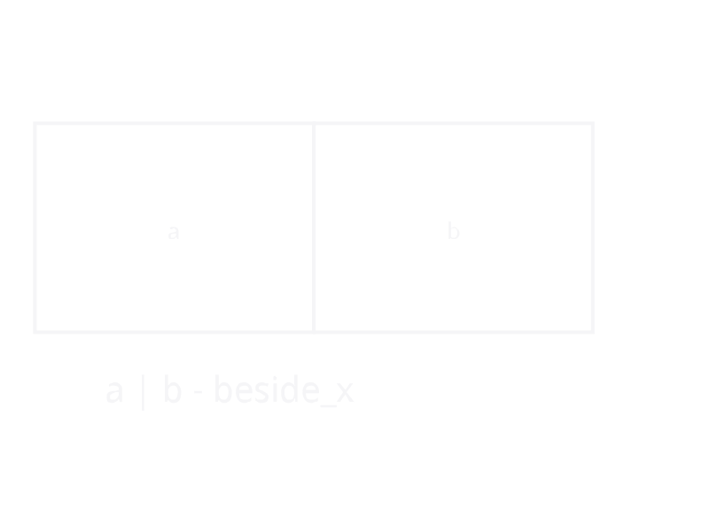
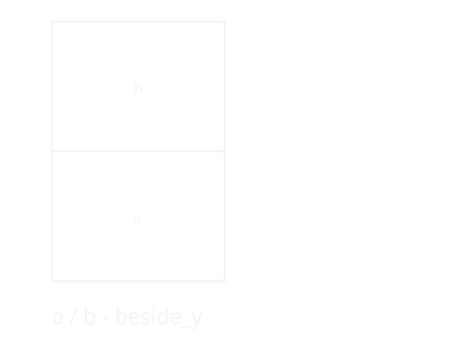
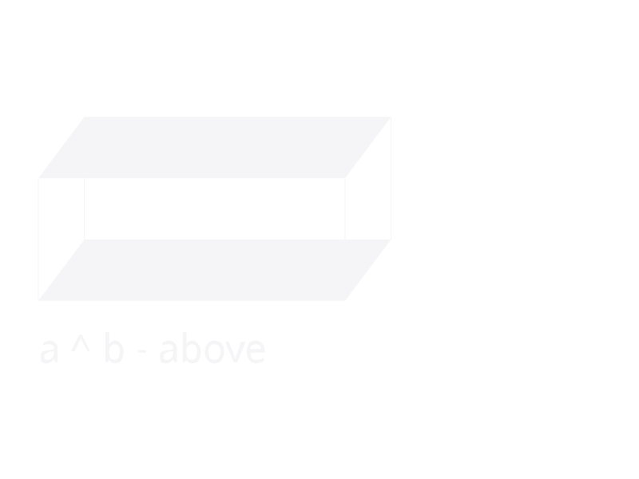
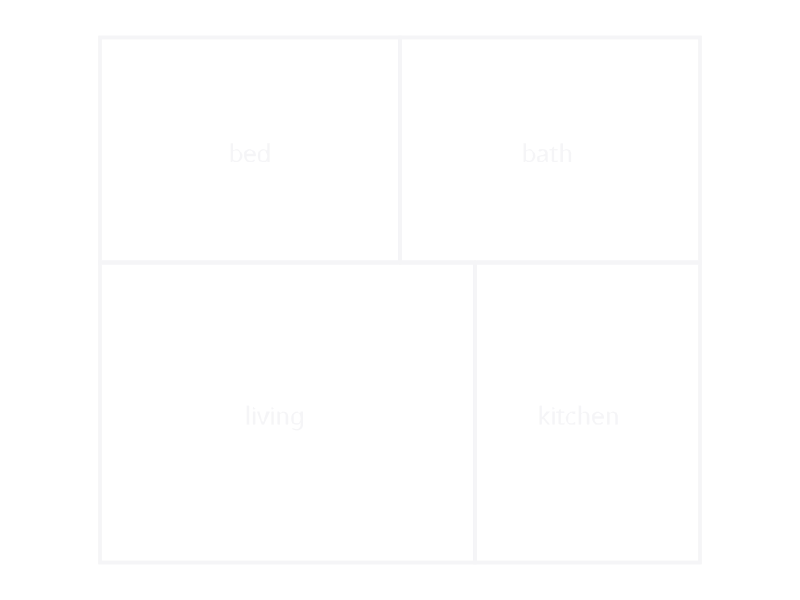
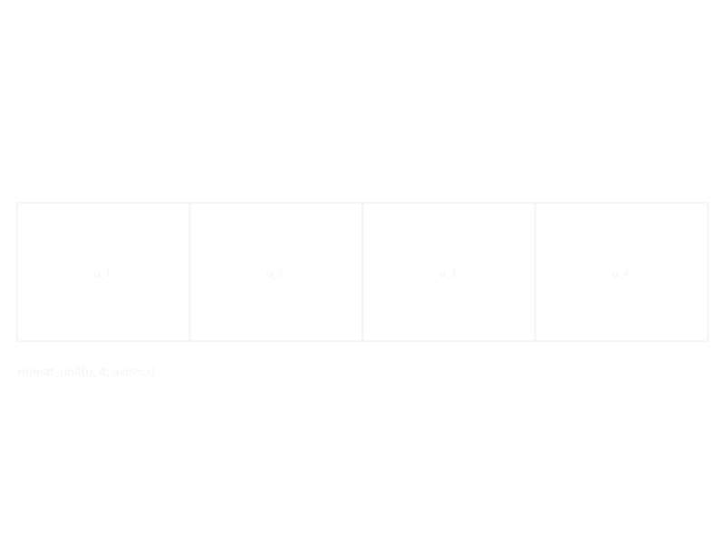
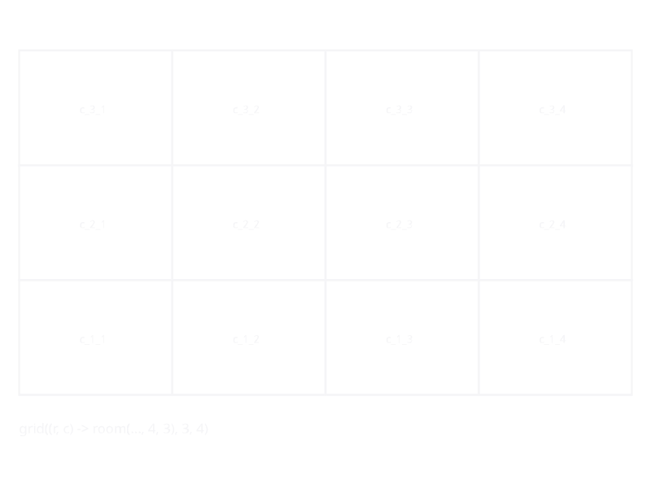
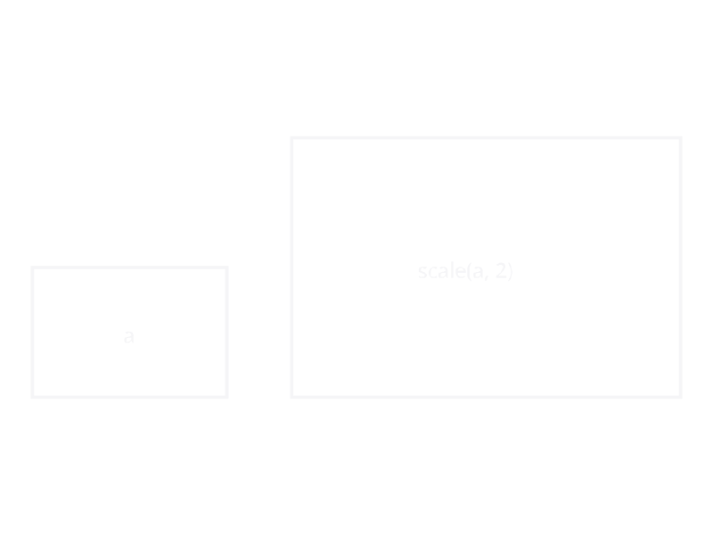
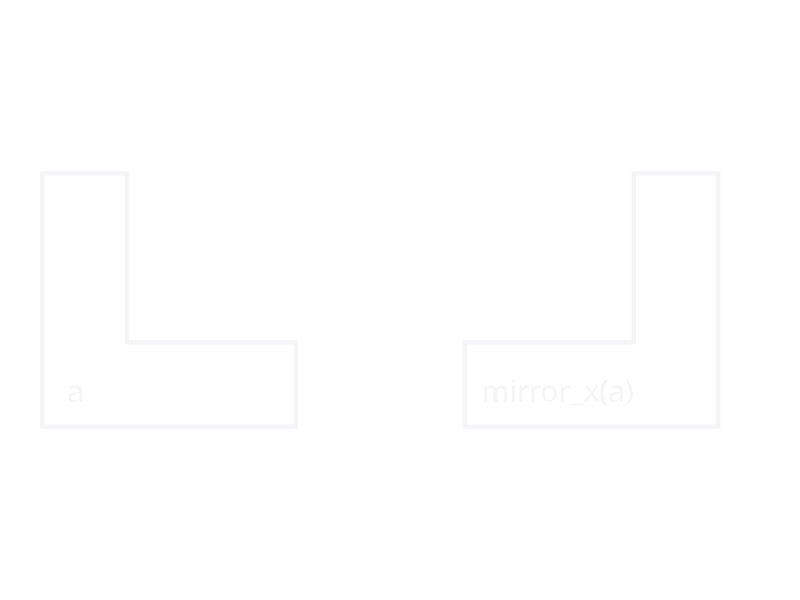

# Composition Operators

## Infix Operators

Three infix operators provide concise spatial composition:

| Operator | Function | Axis | Precedence |
|----------|----------|------|------------|
| `a \| b` | [`beside_x`](@ref) | x (side by side) | lowest |
| `a / b` | [`beside_y`](@ref) | y (front to back) | middle |
| `a ^ b` | [`above`](@ref) | z (stack vertically) | highest |

| `a \| b` | `a / b` | `a ^ b` |
|:---:|:---:|:---:|
|  |  |  |

Precedence follows the architectural hierarchy: vertical stacking
binds tightest, then depth, then width. This means:

```julia
a | b / c      # parses as  a | (b / c)
a / b ^ c      # parses as  a / (b ^ c)
a | b / c ^ d  # parses as  a | (b / (c ^ d))
```

A four-room house combining all three axes:



## Function Forms

### beside / beside_x / beside_y

[`beside`](@ref) is the general form with an `axis` keyword:

```julia
beside(a, b; axis=:x)  # same as beside_x(a, b)
beside(a, b; axis=:y)  # same as beside_y(a, b)
```

Both [`beside`](@ref) and [`above`](@ref) accept variadic arguments:

```julia
beside(a, b, c, d)  # left-associative: ((a | b) | c) | d
above(f1, f2, f3)   # left-associative: (f1 ^ f2) ^ f3
```

Keyword arguments control alignment and wall sharing:

- `shared_wall=true` — adjacent rooms share a single wall. This is
  the only implemented behaviour; `shared_wall=false` (independent
  double walls) throws an `ArgumentError`.
- `align=:start` — positions the smaller room within the pair's
  combined cross extent when depths (`beside_x`) or widths
  (`beside_y`) differ: `:start` keeps it flush at the shared origin,
  `:center` centers it, `:end` aligns the far edges.

### Depth Mismatches

When two rooms of different depths are placed side by side, each
keeps its exact dimensions. The building outline becomes stepped —
no stretching, no void elements:

```
┌─────────┬───────┐
│         │kitchen│
│ living  │3.5x3.0│
│ 5.0x4.0 ├───────┘
│         │         <- stepped facade
└─────────┘
```

## Repetition

[`repeat_unit`](@ref) stamps out copies along an axis with scoped
namespaces:

```julia
repeat_unit(apartment, 4; axis=:x, mirror_alternate=true)
```



Each copy gets a namespace prefix (`unit_1/`, `unit_2/`, ...) to
prevent id collisions. With `mirror_alternate=true`, even-numbered
copies are mirrored.

## Grid

[`grid`](@ref) creates a 2D array of rooms from a function:

```julia
offices = grid((r, c) -> room(Symbol("off_r\$(r)c\$(c)"), :office, 4.0, 5.0), 3, 5)
```



Cells can have different sizes — the layout uses each column's
widest cell and each row's deepest cell, so a heterogeneous grid
still places every cell at a consistent grid offset.

## Transforms

- [`scale(s, sx, sy)`](@ref) — scale dimensions
- [`mirror_x(s)`](@ref) / [`mirror_y(s)`](@ref) — reflect

| scale | mirror_x |
|:---:|:---:|
|  |  |

- [`with_height(s, h)`](@ref) — override height for a subtree
- [`with_props(s, nt)`](@ref) — merge a `NamedTuple` of props onto
  every placed space under `s` (existing per-room props win)
- [`tag_wall_family(s, fam)`](@ref) /
  [`tag_slab_family(s, fam)`](@ref) — attach a `WallFamily` /
  `SlabFamily` object to every placed space under `s`; `build` uses
  it in place of the storey default (interior walls require both
  adjoining spaces to agree on the same family). Passing a Symbol
  name throws — there is no name → family registry.
