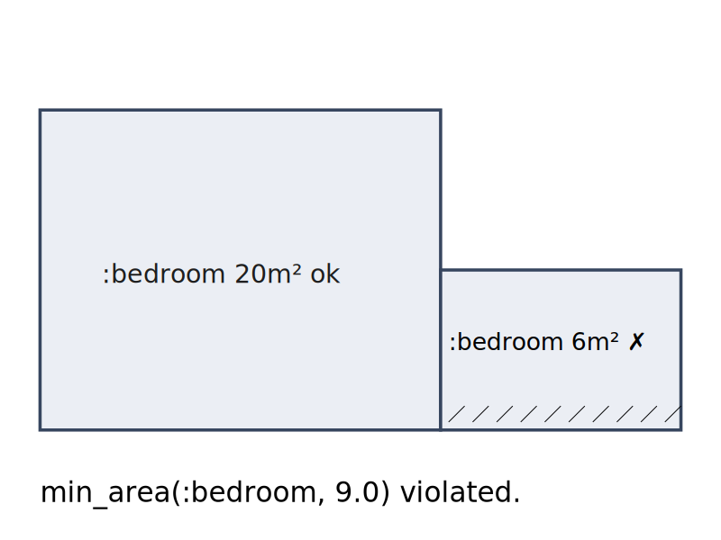
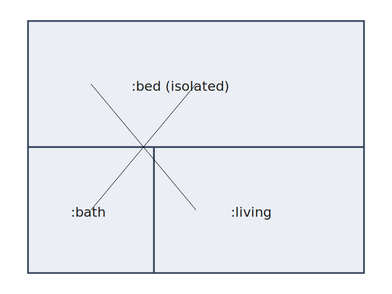

# Constraints

Architectural design is governed by rules — minimum areas for
habitable rooms, mandatory adjacencies between kitchens and dining
spaces, fire-code egress paths, aspect-ratio limits that keep rooms
from becoming pathological corridors. KhepriBase's constraint system
captures these rules as **first-class, composable values** that can
be validated against either a declarative [`Layout`](@ref) or an
imperative `BuildResult`.

This page is the narrative treatment. For the full function and type
reference, see [Constraints (reference)](../reference/constraints.md).

## What a constraint is

A `Constraint` bundles four things:

- A **name** (for reporting).
- A **severity** — `HARD`, `SOFT`, or `PREFERENCE`.
- A **category** — `DIMENSIONAL`, `ADJACENCY`, `AREA_PROPORTION`,
  `CIRCULATION`, or `ENVIRONMENTAL`.
- A **check function** that receives a design context and returns a
  vector of `Violation`s.

The check function is closed over whatever parameters the
constructor took (minimum area, target kind, adjacency pair, etc.).
Validating a vector of constraints is simply "run every check, group
the results by severity":

A minimum-area violation looks like this — the too-small bedroom is
marked with the diagonal hatch:



An unmet `must_adjoin` between rooms that share no boundary:



```julia
using KhepriBase

desc = (room(:living, :living_room, 5.0, 4.0) |
        room(:kitchen, :kitchen,    3.0, 4.0)) /
        room(:bath,   :bathroom,    2.0, 2.0)

rules = [
  min_area(:living_room, 15.0),
  min_area(:bedroom,      9.0),
  min_dimension(:bathroom, 1.8),
  must_adjoin(:bathroom, :bedroom; severity = SOFT),
]

result = validate(layout(desc), rules)
result.passed        # false — the bathroom has no neighbour bedroom
result.hard_violations
result.score         # weighted penalty; lower is better
report(result)       # pretty-print to stdout
```

## Severity: what happens on a violation

Severity controls how the result is interpreted:

| Severity     | Weight in score | Blocks approval? | Typical use                                   |
|--------------|-----------------|------------------|-----------------------------------------------|
| `HARD`       | 1000            | yes              | Building-code minima, mandatory egress.       |
| `SOFT`       | 10              | no (still reported) | Good-practice rules that can be negotiated. |
| `PREFERENCE` | 1               | no               | Nice-to-have aesthetic / orientation hints.  |

`validate` returns a `ValidationResult` whose `passed` field is
`true` iff `hard_violations` is empty. The `score` is a single
weighted number useful for ranking candidate designs in a generative
search.

## Context polymorphism

KhepriBase exposes two compilation paths that both end in a
space-boundary view:

- `layout(desc::SpaceDesc)` — the declarative engine, producing a
  multi-storey `Layout`.
- `build(storey)` — the imperative pipeline, producing a single
  `BuildResult`.

The library constructors (`min_area`, `must_adjoin`, `all_reachable`,
etc.) are written once and dispatch on whichever context they're
handed. A single rule set works for both paths:

```julia
rules = [min_area(:bedroom, 9.0), must_adjoin(:bathroom, :bedroom)]

# Declarative path
validate(layout(desc), rules)

# Imperative path
r = build(floor_plan(...))
validate(r, rules)
```

Behind the scenes, the context accessors in `ConstraintLibrary.jl`
normalise `Layout` and `BuildResult` to a shared "iterable of
spaces" / "iterable of storeys" / "iterable of adjacencies" view
(`_ctx_spaces`, `_ctx_storeys`, `_ctx_adjacencies`), so each
constraint constructor sees the same shape either way. Constraints
that inspect physical doors (`has_door`, `has_connection`) stay
`BuildResult`-only — `Layout` doesn't know about doors until
`build` runs.

## Composing constraints

Constraints compose like logical formulas. Every combinator returns
a new `Constraint`:

- `combine(c1, c2, …)` — conjunction; violations are concatenated,
  severity is the max of the inputs.
- `either(a, b)` — disjunction; passes when at least one side has
  no violations. If both fail, the fewer-violation side is reported.
- `when(predicate, c)` — gate `c` so its check runs only when
  `predicate(ctx)` is true. Useful for rules that apply only to
  multi-storey buildings, only to residential programmes, etc.
- `with_severity(c, sev)` — override the severity of an existing
  constraint (e.g., promote a `SOFT` library rule to `HARD` for a
  specific project).
- `merge_constraints(sets...)` — concatenate several
  `ConstraintSet`s into one.

```julia
# "every bedroom must be ≥ 9 m² AND have min dim ≥ 2.4 m"
bedroom_rule = combine(
  min_area(:bedroom, 9.0),
  min_dimension(:bedroom, 2.4),
)

# "either there is a dining room, or the kitchen is ≥ 12 m²"
dining_or_big_kitchen = either(
  has_kind_present(:dining),          # user-written
  min_area(:kitchen, 12.0),
)

# Only enforce vertical alignment if there are ≥ 2 storeys
stack_rule = when(ctx -> length(ctx.storeys) ≥ 2,
                   vertical_alignment(:bathroom))
```

## The category taxonomy

Categories are informational — they don't change validation
behaviour but they let you slice a `ValidationResult` by concern:

- **DIMENSIONAL** — areas, widths, depths, heights, aspect ratios.
- **ADJACENCY** — which kinds of spaces must or must not share
  boundaries.
- **AREA_PROPORTION** — relative areas across kinds (e.g.,
  circulation-to-usable ratio).
- **CIRCULATION** — reachability, dead-end corridors, egress
  routes.
- **ENVIRONMENTAL** — exposure to exterior, orientation, facade
  coverage.

A reporting dashboard can group violations by category to help a
designer triage "which kind of rule am I breaking the most?".

## The fixer loop

Validating a failing design is only half the story; the other half
is fixing it. `ConstraintFixer` pairs a **constraint-name
substring** with a **transform** `(desc, violation) -> desc'` that
rewrites the description in response.

```julia
fixer = ConstraintFixer(
  "enlarge_bedroom",                   # name, for logs
  "min_area_bedroom",                  # matches Violation.constraint_name
  (desc, v) -> update_room_by_id(desc, Symbol(v.target)) do r
    room(r.id, r.use, r.width * 1.1, r.depth * 1.1; height=r.height, props=r.props)
  end,
)

final_desc, final_result = apply_fixers(desc, layout, rules, [fixer])
```

`apply_fixers` iterates:

1. Build a context via `build(desc)` (any function with that shape).
2. Validate against the constraint vector.
3. For each hard violation, apply the first fixer whose `pattern`
   occurs in the violation's `constraint_name`.
4. Stop when the result is hard-clean, when no fixer matches, or
   when `max_iters` is reached.

The transform is free to return a completely different tree; the
fixer is just a pattern-matching rewrite rule over designs.

## When to use what

- **Write a library constraint** when the rule is reusable across
  projects — minimum areas, code-driven egress, orientation
  preferences.
- **Write a one-off check function and wrap it in `Constraint`**
  when the rule is specific to a single project or typology.
- **Use `with_severity`** to adjust the strictness of a library
  rule for a particular client or regulatory context, without
  rewriting the check.
- **Use the fixer loop** during generative design, where you want
  the search to self-repair small violations rather than discard
  the whole candidate.
- **Skip constraints entirely** for early sketches — the system is
  designed so that `layout(desc)` alone produces a valid geometric
  result; validation is a separate, opt-in pass.

## See also

- [Constraints (reference)](../reference/constraints.md) — every
  type, combinator, and library constructor with signatures.
- [Designs (Level 2)](designs.md) — the declarative tree the
  constraint library validates.
- [Layout Engine](../reference/layout-engine.md) — how `layout(desc)`
  produces the `Layout` that constraints see.
- [Adjacencies](../reference/adjacencies.md) — the shared-edge
  records adjacency-category constraints inspect.
