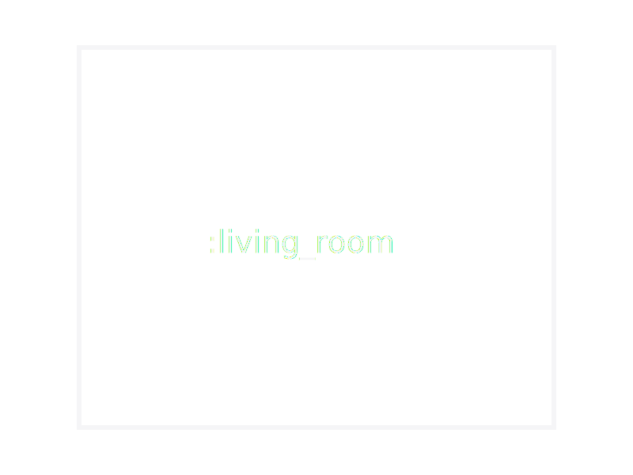
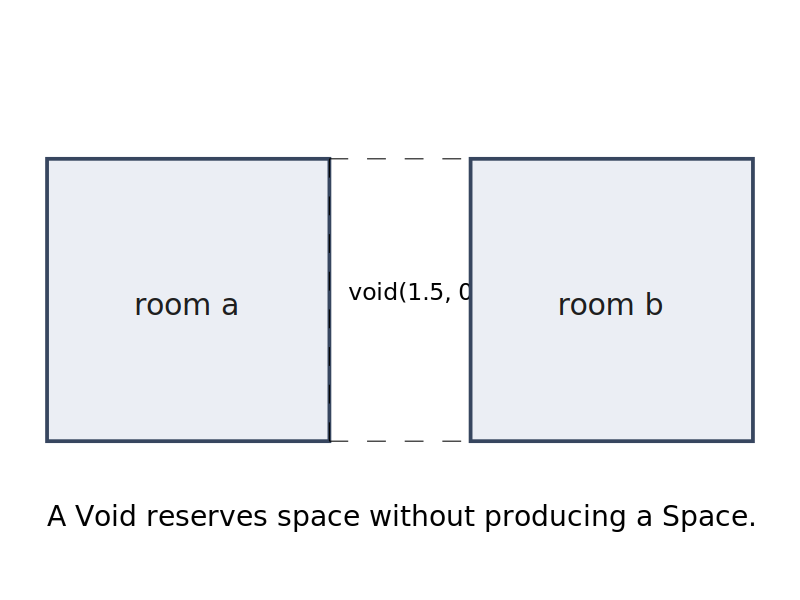
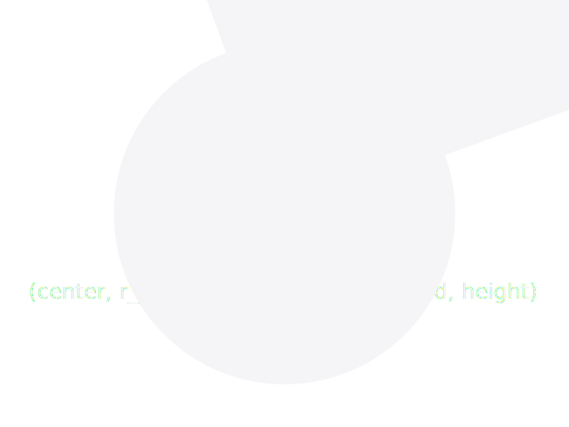

# Space Descriptions

A [`SpaceDesc`](@ref) is an immutable value that describes a spatial
arrangement. It forms a tree whose leaves are individual rooms and
whose internal nodes are composition operators.

`SpaceDesc` is KhepriBase's Level-2 representation (see
[Levels of Abstraction](@ref "Levels of Abstraction")). Where a
[`Layout`](@ref) (Level 1) holds an explicit list of placed spaces
with boundaries, a `SpaceDesc` holds the *recipe* that
[`layout`](@ref) compiles into those spaces.

## Leaf Nodes

### Room

A [`Room`](@ref) is the fundamental building block. It carries an
identifier, a use (e.g. `:bedroom`, `:kitchen`), preferred dimensions,
and optional properties:

```julia
bed = room(:bed, :bedroom, 4.0, 3.5)
bed = room(:bed, :bedroom, 4.0, 3.5; height=3.0, props=(min_windows=2,))
```



The `width` and `depth` are exact — the layout engine preserves them.
When adjacent rooms have different depths, the building outline
becomes stepped (no stretching).

### Void

A [`Void`](@ref) represents empty space. A zero-sized `void()` is the
true identity for `beside_x`, `beside_y`, and `above` — the
combinators elide it at construction time, so `void() | a === a`.

A sized `void(w, d)` instead reserves that rectangle as a gap. Use
it as a spacer when two rooms should not touch (e.g. around a service
shaft):

```julia
# Conditionally include a balcony, or nothing if absent.
apartment = bed | kitchen | (has_balcony ? balcony : void())

# Two rooms with a 2 m gap between them (no shared wall, no adjacency).
plan = room(:a, :bedroom, 4.0, 3.0) | void(2.0, 3.0) | room(:b, :bedroom, 4.0, 3.0)
```



### Envelope

An `Envelope` defines a rectangular volume for top-down subdivision. It works like a room but is meant to be partitioned into
smaller zones:

```julia
floor = envelope(20.0, 10.0, 2.8)
```


A polar envelope is a ring sector — the root of a polar subtree:



## Composite Nodes

Composite nodes are created by combinators (see
[Composition Operators](@ref "Composition Operators")):

- [`BesideX`](@ref) — horizontal adjacency (x-axis)
- [`BesideY`](@ref) — depth adjacency (y-axis)
- [`Above`](@ref) — vertical stacking (z-axis)
- [`Repeated`](@ref) — unit repetition with scoped namespaces
- [`GridLayout`](@ref) — 2D grid of rooms
- [`Scaled`](@ref), [`Mirrored`](@ref), [`HeightOverride`](@ref) —
  transforms
- [`PropsOverlay`](@ref) — merges a `NamedTuple` of props onto every
  placed space under its subtree; surfaced by [`with_props`](@ref),
  [`tag_wall_family`](@ref), and [`tag_slab_family`](@ref)

## Annotation Nodes

[`Annotated`](@ref) wraps a `SpaceDesc` with an override annotation.
Annotations are transparent to layout — they only affect downstream
element generation:

```julia
plan |> d -> connect(d, :a, :b, kind=:door)  # wraps in Annotated node
```

## Subdivision Nodes

For top-down design (see [Top-Down Subdivision](@ref)):

- [`Subdivided`](@ref) — proportional or absolute-position zone
  division (`subdivide_x`, `subdivide_y`, `split_x`, `split_y`)
- [`Partitioned`](@ref) — equal zone division
- [`Carved`](@ref) — freeform zone placement
- [`Refined`](@ref) — zone replacement with a sub-tree
- [`Assigned`](@ref) — zone use assignment
- [`SubdivideRemaining`](@ref) — perimeter blocks around a central
  carve

## Immutability

All `SpaceDesc` types are immutable structs. Combinators return new
trees without modifying their inputs. This enables safe comparison of
design variants and eliminates mutable state bugs.
