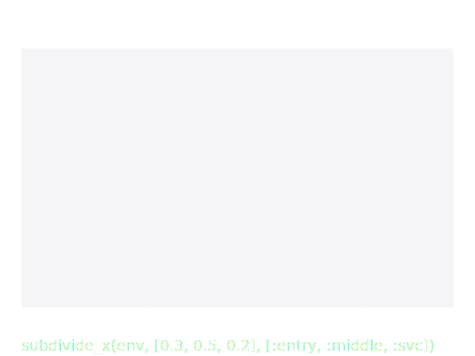
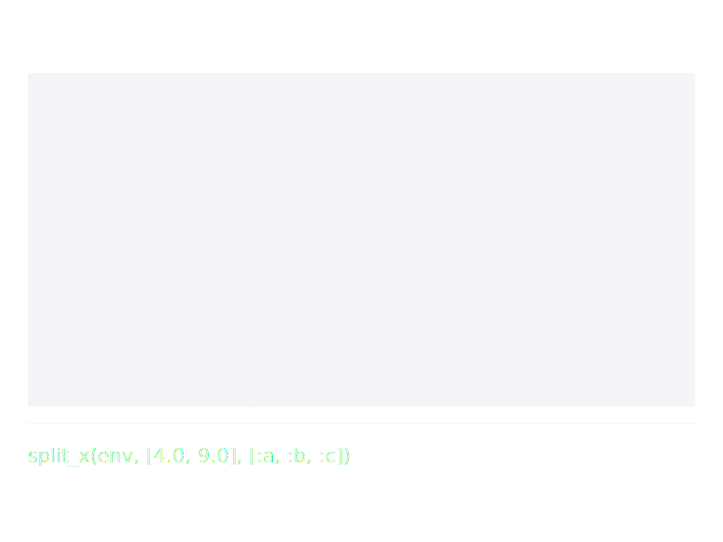
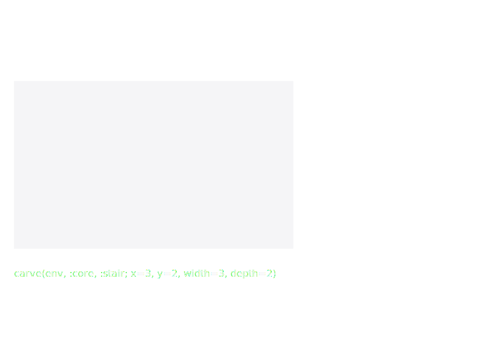
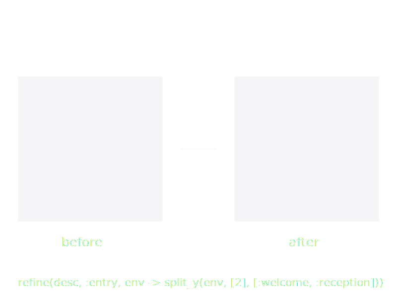

# Top-Down Subdivision

The bottom-up approach composes rooms into floors. The top-down
approach starts from a building `envelope` and partitions it into
zones.

Both approaches produce the same `SpaceDesc` tree and can be mixed
freely.

## Envelope

An `Envelope` defines a rectangular volume to be subdivided:

```julia
floor = envelope(20.0, 10.0, 2.8)
```

## Proportional Subdivision

[`subdivide_x`](@ref) and [`subdivide_y`](@ref) split a space into
zones by proportional ratios (must sum to 1.0):

```julia
floor |> e -> subdivide_x(e, [0.3, 0.4, 0.3], [:left, :center, :right])
```

This creates three zones: left (30% of width), center (40%), right
(30%).



## Absolute-Position Splits

[`split_x`](@ref) and [`split_y`](@ref) cut a space at absolute
positions instead of ratios. `n` positions produce `n+1` zones;
positions must be strictly ascending and lie inside the base.

```julia
envelope(20.0, 12.0, 3.0) |>
  e -> split_x(e, [6.0, 16.0], [:entry, :middle, :service])
# zones of width 6, 10, 4 metres
```



Use `split_x`/`split_y` when a design needs a fixed-width corridor
or service zone regardless of the envelope size; use `subdivide_x`/
`subdivide_y` when the shape should scale proportionally with the
envelope.

## Equal Partition

[`partition_x`](@ref) and [`partition_y`](@ref) split into equal
parts with auto-generated ids:

```julia
floor |> e -> partition_x(e, 5, :office)
# Creates :office_1, :office_2, :office_3, :office_4, :office_5
```


## Carving

[`carve`](@ref) places a named room at specific coordinates within a
space:

```julia
floor |> e -> carve(e, :meeting, :meeting_room; x=2.0, y=3.0, width=5.0, depth=4.0)
```



## Refining Zones

[`refine`](@ref) replaces a zone with an arbitrary sub-tree. The
transform function receives an envelope with the zone's dimensions:

```julia
subdivide_x(floor, [0.5, 0.5], [:left, :right]) |>
  refine(:left, env -> room(:office, :private_office, env.width, env.depth))
```

A curried form enables piping:

```julia
floor |>
  e -> subdivide_x(e, [0.5, 0.5], [:left, :right]) |>
  refine(:left, env -> room(:office, :private_office, env.width, env.depth))
```



## Assigning Uses

[`assign`](@ref) sets the use of a zone without changing its
geometry:

```julia
subdivide_x(floor, [0.5, 0.5], [:left, :right]) |>
  assign(:left, :office)
```

[`assign_all`](@ref) assigns the same use to all zones matching a
prefix:

```julia
partition_x(floor, 5, :office) |>
  assign_all(:office, :private_office)
```

Both have curried forms for piping.

## Subdividing Around a Carved Hole

[`subdivide_remaining`](@ref) converts the remaining area around a
single central carve into named perimeter blocks — the canonical
courtyard pattern.

```julia
envelope(50.0, 40.0, 3.0) |>
  e -> carve(e, :courtyard, :garden; x=12.0, y=10.0, width=26.0, depth=20.0) |>
  subdivide_remaining([
    (:north_block, :north),
    (:south_block, :south),
    (:east_block,  :east),
    (:west_block,  :west),
  ])
```


Each block is emitted as a zone with `use = :zone`; refine it with
[`refine`](@ref) or promote it with [`assign`](@ref) the same way
you would any other subdivision.

## Mixing Paradigms

A top-down zone can be replaced with a bottom-up composition:

```julia
envelope(30.0, 12.0, 2.8) |>
  e -> subdivide_x(e, [0.3, 0.4, 0.3], [:wing_a, :core, :wing_b]) |>
  assign(:core, :corridor) |>
  refine(:wing_a, _ -> apartment(n_bedrooms=2)) |>
  refine(:wing_b, _ -> mirror_x(apartment(n_bedrooms=2)))
```
