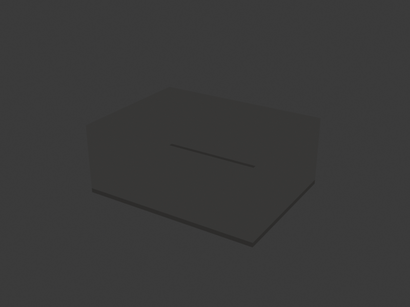

# Camera and Rendering

This page documents the camera, rendering, and film animation system defined in
`Camera.jl` and `Frontend.jl`.

Three view presets of the same scene:

| Isometric | Top (plan) | Elevation |
|:---:|:---:|:---:|
|  |  |  |

## Render Parameters

All render parameters are `Parameter` instances and can be temporarily overridden
with `with(param, value) do ... end`.

| Parameter | Type | Default | Description |
|-----------|------|---------|-------------|
| `render_dir` | `Parameter(String)` | `homedir()` | Root render output directory. |
| `render_user_dir` | `Parameter(String)` | `"."` | User-specific subdirectory. |
| `render_backend_dir` | `Parameter(String)` | `"."` | Backend-specific subdirectory. |
| `render_kind_dir` | `Parameter(String)` | `"Render"` | Subdirectory for the render kind (`"Render"`, `"RenderWhite"`, `"RenderBlack"`, `"Film"`). |
| `render_color_dir` | `Parameter(String)` | `"."` | Subdirectory for color variants. |
| `render_ext` | `Parameter(String)` | `".png"` | File extension for rendered images. |
| `render_width` | `Parameter(Int)` | `1024` | Image width in pixels. |
| `render_height` | `Parameter(Int)` | `768` | Image height in pixels. |
| `render_quality` | `Parameter{Real}` | `0` | Quality setting in `[-1, 1]`. |
| `render_exposure` | `Parameter{Real}` | `0` | Exposure adjustment in `[-3, +3]`. |
| `render_floor_width` | `Parameter(Int)` | `1000` | Ground plane width. |
| `render_floor_height` | `Parameter(Int)` | `1000` | Ground plane height. |

### Render size

```julia
render_size()                          -> (width, height)
render_size(width::Integer, height::Integer) -> (width, height)
```

Query or set the render dimensions.  The setter updates both `render_width` and
`render_height` and returns the new values.

### Render path

```julia
render_default_pathname(name::String) -> String
```

Computes the full output path by joining all render directory parameters:

```
render_dir / render_user_dir / render_backend_dir / render_kind_dir / render_color_dir / <name><render_ext>
```

## Render Kind

```julia
render_kind        # Parameter{Symbol}, default :realistic
```

Controls the visual style of the render.  Recognized values:

| Symbol | Description | Subdirectory |
|--------|-------------|--------------|
| `:realistic` | Full materials and lighting | `"Render"` |
| `:white` | White/clay model look | `"RenderWhite"` |
| `:black` | Black background clay model | `"RenderBlack"` |

## Core Render Functions

### `render_setup`

```julia
render_setup(kind::Symbol=:realistic, backend::Backend=top_backend())
```

Prepares the rendering pipeline:

1. Sets `render_kind_dir` from the kind symbol.
2. Stores the kind in the `render_kind` parameter.
3. Calls `b_render_initial_setup(backend, kind)` so the backend can configure
   materials, environment, etc.

### `render_view`

```julia
render_view(name::String="View", backend::Backend=top_backend())
```

Renders the current scene and saves the image.  Delegates to
`b_render_view(backend, name)`, which by default:

1. Computes the output path via `prepare_for_saving_file(b_render_pathname(b, name))`.
2. Calls `b_render_final_setup(b, render_kind())`.
3. Calls `b_render_and_save_view(b, path)`.

### `rendering_with`

```julia
rendering_with(f;
    dir=render_dir(), user_dir=render_user_dir(),
    backend_dir=render_backend_dir(), kind_dir=render_kind_dir(),
    color_dir=render_color_dir(), ext=render_ext(),
    width=render_width(), height=render_height(),
    quality=render_quality(), exposure=render_exposure(),
    floor_width=render_floor_width(), floor_height=render_floor_height())
```

Executes `f()` with all render parameters temporarily overridden to the given
values.  Useful for batch rendering at different resolutions or quality levels.

### `to_render` / `to_film`

```julia
to_render(f, name)    # delete_all_shapes(), f(), render_view(name)
to_film(f, name)      # start_film(name), f()
```

Convenience wrappers that combine scene setup with rendering or film recording.

## Camera and View

### `default_lens` / `default_aperture`

```julia
default_lens     # Parameter(50)   -- focal length in mm (35mm equivalent)
default_aperture # Parameter(32)   -- f-stop number
```

### `set_view`

```julia
set_view(camera::Loc, target::Loc, lens::Real=50, aperture::Real=32;
         backends=current_backends())
```

Sets the camera position, target point, focal length, and aperture on all
active backends.  Dispatches to `b_set_view` which uses the `view_type` trait
to decide whether the view is stored locally (`FrontendView`) or sent to the
remote application (`BackendView`).

### `get_view`

```julia
get_view(; backend=top_backend()) -> (camera, target, lens)
```

Retrieves the current camera, target, and lens from the backend.

### `view_angles`

```julia
view_angles(lens=default_lens(), width=render_width(), height=render_height())
  -> (h_angle, v_angle)
```

Computes horizontal and vertical field-of-view angles (in degrees) from the
lens focal length and render dimensions, assuming a 36mm sensor width.

## View Struct

```julia
mutable struct View
  camera::Loc
  target::Loc
  lens::Real
  aperture::Real
  is_top_view::Bool
end

default_view() = View(xyz(10,10,10), xyz(0,0,0), 35, 22, false)
top_view()     = View(xyz(0,0,10),   xyz(0,0,0),  0,  0, true)
```

Backends with `FrontendView()` view type store a `View` instance in their
`view` field.

## Film Parameters and Functions

The film system captures a sequence of rendered frames that can later be
assembled into a video.

| Parameter | Type | Default | Description |
|-----------|------|---------|-------------|
| `film_active` | `Parameter(Bool)` | `false` | Whether film recording is active. |
| `film_filename` | `Parameter(String)` | `""` | Base filename for the film. |
| `film_frame` | `Parameter(Int)` | `0` | Current frame counter. |
| `saving_film_frames` | `Parameter(Bool)` | `true` | When `false`, `save_film_frame` sleeps instead of rendering. |

### `start_film`

```julia
start_film(name::String)
```

Begins a new film recording: activates film mode, sets the filename, and resets
the frame counter to 0.

### `save_film_frame`

```julia
save_film_frame(obj=true; backend=top_backend())
```

Renders and saves the current frame.  The output path is computed with
`render_kind_dir` set to `"Film"`.  The frame filename is
`<film_filename>-frame-<NNN>` where `NNN` is zero-padded to 3 digits.
Increments `film_frame` after each save.  Returns `obj` for chaining.

When `saving_film_frames()` is `false`, sleeps for 0.1 seconds instead
(useful for preview/debug).

### `finish_film`

```julia
finish_film()
```

Deactivates film mode and calls `create_mp4_from_frames` to assemble frames
into a video using `ffmpeg`.

### `frame_filename`

```julia
frame_filename(filename::String, i::Integer) -> String
```

Returns `"<filename>-frame-<NNN>"` where `NNN` is `i` zero-padded to 3 digits.

### `film_pathname`

```julia
film_pathname() -> String
```

Full path for the current film frame.

## Camera Motion Functions

All camera motion functions iterate over paths or parameter ranges, calling
`set_view_save_frame` at each step to set the view and capture a film frame.

### `set_view_save_frame`

```julia
set_view_save_frame(camera, target, lens=default_lens(), aperture=default_aperture())
```

Sets the view and saves one film frame.

### `set_view_save_frames`

```julia
set_view_save_frames(cameras::Locs, targets::Locs, lens::Real=default_lens(), aperture::Real=default_aperture())
set_view_save_frames(cameras::Locs, targets::Locs, lenses::Vector{<:Real}, apertures::Vector{<:Real})
```

Iterates over paired camera/target arrays, saving one frame per pair.  The
second variant allows per-frame lens and aperture values.

### `track_still_target`

```julia
track_still_target(camera_path, target, lens=default_lens(), aperture=default_aperture())
```

The camera orbits around a fixed target.  One frame per position in
`camera_path`.

### `track_moving_target`

```julia
track_moving_target(camera, targets, lens=default_lens(), aperture=default_aperture())
```

The camera follows the target at a fixed offset (computed from the initial
camera-to-target vector).

### `walkthrough`

```julia
walkthrough(path, camera_spread, lens=default_lens(), aperture=default_aperture())
```

The camera walks along `path` while looking ahead.  `camera_spread` is the
number of positions separating the camera from the look-at point along the
path.

### `panning`

```julia
panning(camera, targets, lens=default_lens(), aperture=default_aperture())
```

The camera stays fixed while the target sweeps through a list of positions
(camera rotation effect).

### `lens_zoom`

```julia
lens_zoom(camera, target, delta, frames, lens=default_lens(), aperture=default_aperture())
```

Fixed camera and target.  The lens focal length changes linearly by `delta` per
frame over `frames` frames.  `delta > 0` zooms in, `delta < 0` zooms out.

### `dolly_effect_back`

```julia
dolly_effect_back(delta, camera, target, lens, frames)
```

Dolly zoom (Vertigo effect) pulling the camera backwards while increasing the
focal length to maintain the apparent size of the target.  `delta` is the
per-frame distance increment.  Recursive: renders `frames` frames.

### `dolly_effect_forth`

```julia
dolly_effect_forth(delta, camera, target, lens, frames)
```

Dolly zoom pushing the camera forward while decreasing the focal length.

### `interpolate_view_save_frames`

```julia
interpolate_view_save_frames(ctl_positions, nframes)
```

Interpolates camera and target paths through a list of control positions (each
a `(camera, target, lens)` tuple) using open spline paths, then saves `nframes`
frames along the interpolated trajectory.

### `select_camera_target_lens_positions`

```julia
select_camera_target_lens_positions() -> Vector
```

Interactive helper: repeatedly calls `select_position()` and `get_view()` to
collect a sequence of `(camera, target, lens)` control points, returning them
as a vector. Terminates when `select_position()` returns `nothing`.
