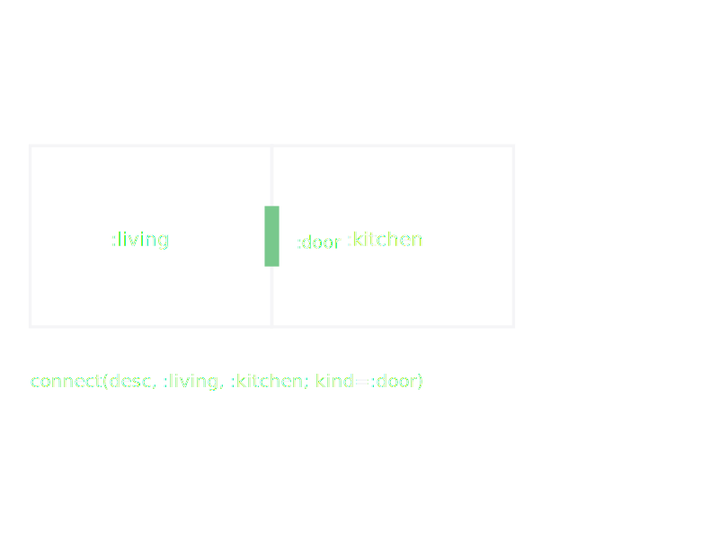
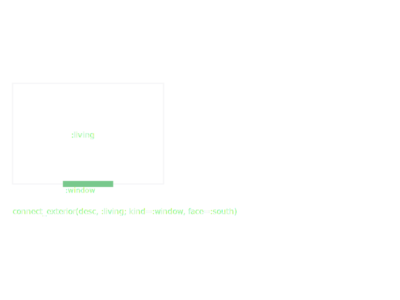

# Annotations

Annotations attach metadata to a [`SpaceDesc`](@ref) subtree without
changing its geometry. Downstream consumers (such as an element
generator or the `build(layout)` pipeline) inspect annotations to
decide where to place doors, which walls stay solid, and which
spaces opt out of automatic windows.

```julia
house = (room(:living, :living_room, 5.0, 4.0) |
         room(:kitchen, :kitchen, 3.5, 4.0)) |>
  d -> connect(d, :living, :kitchen; kind=:arch, width=1.8) |>
  d -> connect_exterior(d, :living; kind=:door, face=:south) |>
  d -> no_windows(d, :kitchen)                 # kitchen is an interior galley

# Remove a default connection between neighbouring rooms:
disconnect(house, :living, :kitchen)
```

Nested `Annotated` wrappers compose transparently: layout walks
through them and `collect_annotations` gathers them for downstream
use.

`connect` marks an interior boundary as needing a door / arch:



`connect_exterior` marks an exterior face as needing a window or door:



## Types

```@docs
DesignAnnotation
ConnectAnnotation
ConnectExteriorAnnotation
DisconnectAnnotation
NoWindowsAnnotation
```

## Functions

```@docs
connect
connect_exterior
disconnect
no_windows
```
