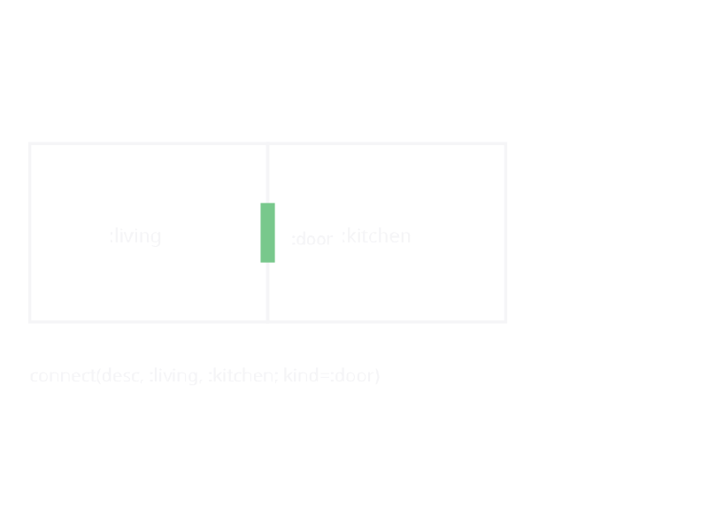
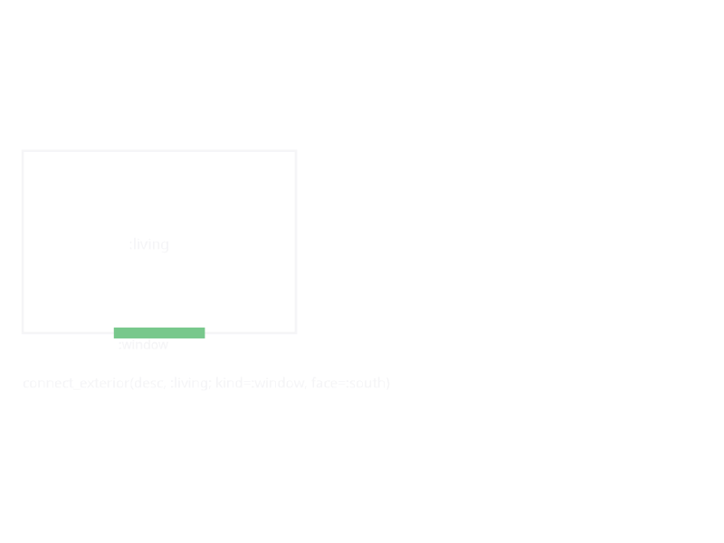

# Annotations

Annotations attach metadata to a [`SpaceDesc`](@ref) subtree without
changing its geometry. `build(layout)` lowers them into standard
`SpaceConnection`s — actual doors, windows, and arches on the built
walls — so the same annotated design produces the same openings on
every backend.

```julia
house = (room(:living, :living_room, 5.0, 4.0) |
         room(:kitchen, :kitchen, 3.5, 4.0)) |>
  d -> connect_spaces(d, :living, :kitchen; kind=:arch) |>
  d -> connect_exterior(d, :living; kind=:door, face=:south) |>
  d -> no_windows(d, :kitchen)                 # kitchen is an interior galley

build(layout(house))   # exterior door on the south facade; living/kitchen
                       # wall elided by the arch; no kitchen windows

# Remove any connection between neighbouring rooms, including one
# declared by a connect_spaces elsewhere in the tree:
disconnect(house, :living, :kitchen)
```

Nested `Annotated` wrappers compose transparently: layout walks
through them and `collect_annotations` gathers them for `build`.

## Lowering semantics

`build(l::Layout)` computes effective per-storey connections from the
storeys' explicit `connections` plus the layout's annotations. The
lowering is *pure* — it never mutates the storeys, so rebuilding (as
`validate(l)` does repeatedly) never duplicates openings. It proceeds
in two phases:

1. **Additive** — every `connect_spaces` / `connect_exterior`
   annotation adds a connection, in tree order (outermost wrapper
   first). `connect_spaces` mirrors `add_door` / `add_window` /
   `add_arch` defaults (`width`/`height` derive a family from the
   current default); `connect_exterior` places `count` openings at
   even fractions along the chosen face (`:north`/`:south`/`:east`/
   `:west` are bounding-box faces, north = +y; `:auto` picks the
   longest exterior edge).
2. **Subtractive** — every `disconnect` removes *any* interior
   connection between its two spaces, and `no_windows` removes every
   window (interior or exterior) touching its space. Removals run
   after all additions, so they win regardless of how the `Annotated`
   wrappers were nested; removing a connection that doesn't exist is
   a no-op.

Misuse fails loudly with an `ArgumentError` instead of silently
producing nothing: unknown space ids (note that ids inside
`repeat_unit` exist only in their per-copy `unit_<i>/<id>` scoped
form), interior connections between spaces on different storeys,
unsupported `kind`s or `face`s, `count < 1`, and `width`/`height`
combined with `kind=:arch` (an arch elides the wall and carries no
family).

Known gap: annotations attached *inside* a `repeat_unit` unit or a
`grid` cell are not scoped per copy — a unit-internal annotation
references the unscoped id and therefore errors (repeat) or is not
collected at all (grid). Annotate the assembled tree from outside,
using the scoped `unit_<i>/<id>` ids.

`connect_spaces` marks an interior boundary as needing a door / arch:



`connect_exterior` marks an exterior face as needing a window or door:



## Types

```@docs
DesignAnnotation
ConnectAnnotation
ConnectExteriorAnnotation
DisconnectAnnotation
NoWindowsAnnotation
```

## Functions

```@docs
connect_spaces
connect_exterior
disconnect
no_windows
```
