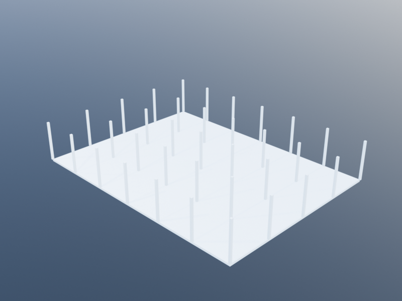
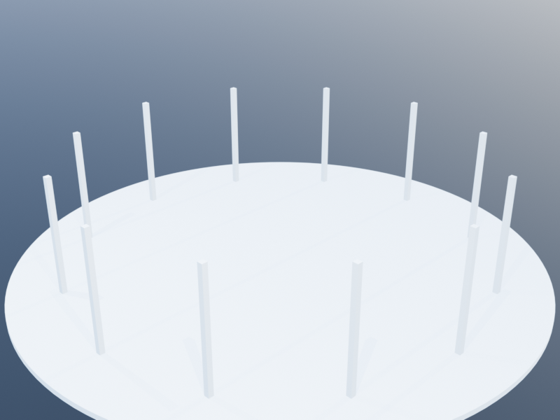
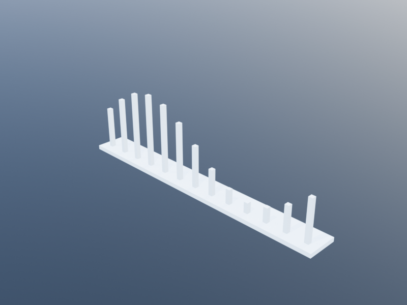
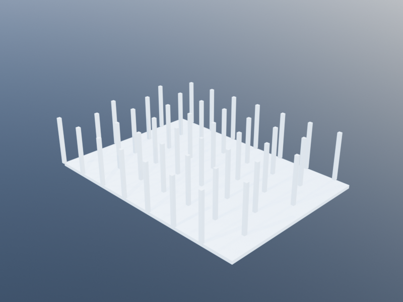
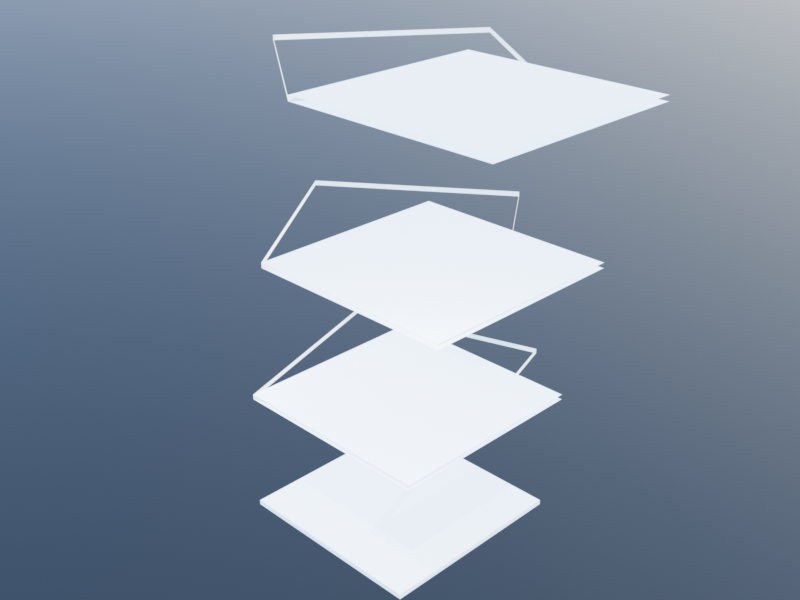

# Algorithmic and Parametric Design Tutorial

This tutorial demonstrates how to use Khepri's utility functions and coordinate
system to create parametric, algorithmic, and generative designs. The patterns
shown here form the foundation for procedural architecture, facade generation,
mathematical surfaces, and recursive structures.

| Column grid | Recursive setback tower | Radial colonnade |
|:---:|:---:|:---:|
|  |  |  |

More parametric constructions — a sinusoidal colonnade (`division` +
`map`), a staggered grid (alternating row offsets), and a six-slab
spiral tower driven by `cs_from_o_phi`:

| Sine facade | Staggered grid | Spiral tower |
|:---:|:---:|:---:|
|  |  |  |

## Subdivision with division and map_division

The `division` function produces evenly-spaced values between two endpoints:

```julia
division(t0, t1, n, include_last=true)
```

It returns `n + 1` values (including both endpoints) by default:

```julia
division(0, 10, 5)
# => [0.0, 2.0, 4.0, 6.0, 8.0, 10.0]

division(0, 10, 5, false)
# => [0.0, 2.0, 4.0, 6.0, 8.0]
```

The `map_division` function applies a function to each subdivided value,
combining subdivision and mapping in a single step:

```julia
map_division(f, t0, t1, n, include_last=true)
```

This is the standard way to place geometry at regular intervals:

```julia
# Place 6 spheres along the X axis from x=0 to x=10
map_division(x -> sphere(xyz(x, 0, 0), 0.5), 0, 10, 5)
```

You can exclude the last point, which is useful for cyclic arrangements:

```julia
# Place spheres in a ring (exclude last to avoid overlap at 2pi)
map_division(0, 2pi, 12, false) do a
  sphere(xyz(10*cos(a), 10*sin(a), 0), 0.5)
end
```

## 2D Grid Generation

`map_division` accepts two ranges to iterate over a 2D grid. There are several
signatures:

```julia
map_division(f, u0, u1, nu, v0, v1, nv)                               # include both last
map_division(f, u0, u1, nu, include_last_u, v0, v1, nv)               # control u last
map_division(f, u0, u1, nu, v0, v1, nv, include_last_v)               # control v last
map_division(f, u0, u1, nu, include_last_u, v0, v1, nv, include_last_v) # control both
```

The function `f` receives two arguments `(u, v)`:

```julia
# Grid of spheres on the XY plane
map_division((x, y) -> sphere(xyz(x, y, 0), 0.3), 0, 10, 5, 0, 10, 5)
```

This creates a 6-by-6 grid of spheres (since `n + 1` values are produced for
each axis).

A more interesting pattern varies the geometry with the coordinates:

```julia
map_division(0, 10, 20, 0, 10, 20) do x, y
  let h = 2 + sin(x) * cos(y)
    box(xyz(x, y, 0), 0.4, 0.4, h)
  end
end
```

## Randomness

Khepri includes a deterministic pseudo-random number generator with three key
functions:

```julia
random(x::Int)                  # random integer in [0, x)
random(x::Real)                 # random float in [0, x)
random_range(x0, x1)            # random value in [x0, x1)
```

The generator uses a global seed stored in the `random_seed` parameter (default
`12345`). Set it with:

```julia
set_random_seed(42)
```

Because the generator is deterministic, using the same seed always produces the
same sequence. This is essential for reproducible parametric designs.

```julia
set_random_seed(7)
map_division(0, 20, 10, 0, 20, 10) do x, y
  let r = random_range(0.2, 0.8),
      h = random_range(1.0, 5.0)
    cylinder(xyz(x, y, 0), r, h)
  end
end
```

## Relative Positioning with translating_current_cs

The function `translating_current_cs` temporarily shifts the current coordinate
system, so that geometry created inside the block is positioned relative to the
new origin:

```julia
translating_current_cs(dx=0, dy=0, dz=0) do
  # geometry here is offset by (dx, dy, dz)
end
```

The keyword arguments `dx`, `dy`, `dz` can also be passed as positional
arguments:

```julia
translating_current_cs(5, 0, 0) do
  box(u0(), 1, 1, 1)     # placed at world xyz(5, 0, 0)
end
```

The `u0()` function returns the origin of the current coordinate system, so
inside the block it refers to the translated origin. This pattern is
particularly powerful for composing transformations:

```julia
translating_current_cs(dx=10) do
  sphere(u0(), 1)                       # at world (10, 0, 0)
  translating_current_cs(dy=5) do
    sphere(u0(), 1)                     # at world (10, 5, 0)
  end
end
```

## Recursive Structures

Combining `translating_current_cs` with recursion produces fractal-like
patterns. Each recursive call shifts the local frame, and shapes drawn with
`u0()` appear at the correct world position automatically.

```julia
function tree_branch(depth, length, radius)
  if depth <= 0
    sphere(u0(), radius * 2)
  else
    cylinder(u0(), radius, length)
    translating_current_cs(dz=length) do
      # Left branch: rotate and recurse
      translating_current_cs(dx=length*0.3) do
        tree_branch(depth - 1, length * 0.7, radius * 0.7)
      end
      # Right branch: rotate and recurse
      translating_current_cs(dx=-length*0.3) do
        tree_branch(depth - 1, length * 0.7, radius * 0.7)
      end
    end
  end
end

tree_branch(5, 4.0, 0.3)
```

A Sierpinski-style tower is another classic example:

```julia
function sierpinski_tower(center, size, depth)
  if depth == 0
    box(center, size, size, size)
  else
    let half = size / 2
      sierpinski_tower(center, half, depth - 1)
      sierpinski_tower(center + vxyz(half, 0, 0), half, depth - 1)
      sierpinski_tower(center + vxyz(0, half, 0), half, depth - 1)
      sierpinski_tower(center + vxyz(0, 0, half), half, depth - 1)
    end
  end
end

sierpinski_tower(u0(), 10.0, 3)
```

## Parametric Facades

Combining `map_division` with conditional logic generates expressive building
facades. The idea is to iterate over a grid of positions and place different
elements depending on local conditions:

```julia
function parametric_facade(width, height, nx, ny)
  map_division(0, width, nx, false, 0, height, ny, false) do u, v
    let panel_w = width / nx,
        panel_h = height / ny,
        center = xyz(u + panel_w/2, 0, v + panel_h/2),
        dist_to_center = distance(center, xyz(width/2, 0, height/2)),
        opening_ratio = 0.3 + 0.5 * sin(dist_to_center * 0.5)
      # Solid panel frame
      box(xyz(u, 0, v), panel_w, 0.2, panel_h)
      # Recessed opening proportional to distance from center
      let ow = panel_w * opening_ratio,
          oh = panel_h * opening_ratio,
          ox = u + (panel_w - ow) / 2,
          oz = v + (panel_h - oh) / 2
        box(xyz(ox, 0.05, oz), ow, 0.15, oh)
      end
    end
  end
end

parametric_facade(30, 20, 15, 10)
```

## Free-Form Surfaces

### surface_grid

The `surface_grid` function creates a NURBS or mesh surface from a matrix of
points:

```julia
surface_grid(points::Matrix{<:Loc}, closed_u, closed_v, smooth_u, smooth_v)
```

- `points` -- a matrix where rows vary along the U direction and columns along
  the V direction.
- `closed_u`, `closed_v` -- whether the surface wraps around in each direction.
- `smooth_u`, `smooth_v` -- whether to interpolate smoothly (spline) or use
  flat facets.

You can also pass a vector of vectors, which will be converted to a matrix:

```julia
surface_grid(pts_vector_of_vectors, closed_u, closed_v, smooth_u, smooth_v)
```

A mathematical surface using `division` to generate the point matrix:

```julia
let pts = [xyz(u, v, sin(u) * cos(v))
           for u in division(0, 2pi, 30),
               v in division(0, 2pi, 30)]
  surface_grid(pts, false, false, true, true)
end
```

A torus-like closed surface:

```julia
let R = 10, r = 3,
    pts = [xyz((R + r*cos(v))*cos(u),
               (R + r*cos(v))*sin(u),
               r*sin(v))
           for u in division(0, 2pi, 40, false),
               v in division(0, 2pi, 20, false)]
  surface_grid(pts, true, true, true, true)
end
```

### surface_mesh

For surfaces that are easier to describe as a triangle or polygon mesh, use
`surface_mesh`:

```julia
surface_mesh(vertices::Locs, faces::Vector{Vector{Int}})
```

- `vertices` -- a flat list of locations.
- `faces` -- each face is a vector of vertex indices (zero-based).

```julia
let verts = [xyz(0,0,0), xyz(1,0,0), xyz(1,1,0), xyz(0,1,0), xyz(0.5,0.5,1)],
    faces = [[0,1,4], [1,2,4], [2,3,4], [3,0,4], [0,1,2,3]]
  surface_mesh(verts, faces)
end
```

## Grasshopper Compatibility Utilities

Khepri includes several functions that mirror Grasshopper components, making it
easier to port visual programming workflows to Julia.

### series

Generates a list of values starting at `s`, stepping by `n`, with `c` elements:

```julia
series(s, n, c)
```

```julia
series(0, 2.5, 5)
# => [0.0, 2.5, 5.0, 7.5, 10.0]
```

### crossref

Produces the Cartesian product of two arrays as a matrix of tuples:

```julia
crossref(as, bs)
```

```julia
crossref([1, 2], [:a, :b, :c])
# => 2x3 Matrix: [(1,:a) (1,:b) (1,:c); (2,:a) (2,:b) (2,:c)]
```

### remap

Remaps a value from one numeric range to another:

```julia
remap(value, (min_in, max_in), (min_out, max_out))
```

```julia
remap(5, (0, 10), (0, 100))
# => 50.0
```

### cull

Filters an array using a boolean template that cycles:

```julia
cull(template, array)
```

```julia
cull([true, false], [1, 2, 3, 4, 5, 6])
# => [1, 3, 5]
```

### map_longest

Applies a function element-wise across arrays, extending shorter arrays by
repeating their last element (Grasshopper's "Longest List" matching):

```julia
map_longest(f, args...)
```

```julia
map_longest(+, [1, 2, 3, 4, 5], [10, 20])
# => [11, 22, 23, 24, 25]
```

### grid_rectangular

Generates a rectangular grid of points centered on a base point:

```julia
grid_rectangular(p, xn, yn, xs=1, ys=1)
```

- `p` -- center point.
- `xn`, `yn` -- number of cells in each direction (grid spans from `-xn` to
  `+xn`).
- `xs`, `ys` -- spacing in each direction.

```julia
grid_rectangular(u0(), 3, 3, 2.0, 2.0)
```

This produces a 7-by-7 grid of points (from -3 to +3 in each axis) with 2-unit
spacing.

### Additional List Helpers

| Function             | Description                                       |
|----------------------|---------------------------------------------------|
| `list_item(L, i)`   | Wrapping index access (`mod`-based)               |
| `cull_pattern(L, P)` | Boolean pattern filter (cycling)                 |
| `shift_list(L, s)`  | Circular shift by `s` positions                   |
| `cull_index(L, I)`  | Remove elements at given indices                  |
| `repeat_data(L, n)` | Repeat list cyclically to length `n`              |
| `duplicate_data(L, n)` | Duplicate each element `n` times               |

## Putting It All Together

The following example creates a parametric pavilion with a wavy roof surface
supported by columns placed on a grid.

```julia
delete_all_shapes()

let nx = 10, ny = 10, spacing = 3.0,
    width = nx * spacing, depth = ny * spacing

  # Columns on a grid
  map_division(0, width, nx, 0, depth, ny) do x, y
    let h = 4 + sin(x * 0.5) * cos(y * 0.5)
      cylinder(xyz(x, y, 0), 0.15, h)
    end
  end

  # Wavy roof surface
  let pts = [let h = 4 + sin(x * 0.5) * cos(y * 0.5)
               xyz(x, y, h)
             end
             for x in division(0, width, nx * 3),
                 y in division(0, depth, ny * 3)]
    surface_grid(pts, false, false, true, true)
  end
end
```

This generates columns whose height follows a sinusoidal wave, topped by a
smooth surface that follows the same mathematical function at a finer
resolution.

## See Also

- [Utilities Reference](../reference/utilities.md) -- full API reference for
  `division`, `map_division`, `random`, `series`, `crossref`, and other
  utilities.
- [Coordinates](../getting_started/coordinates.md) -- details on `xyz`, `u0`,
  `vxyz`, coordinate systems, and `translating_current_cs`.
- [Shapes](../concepts/shapes.md) -- reference for all shape constructors
  (`box`, `sphere`, `cylinder`, `surface_grid`, `surface_mesh`, etc.).
