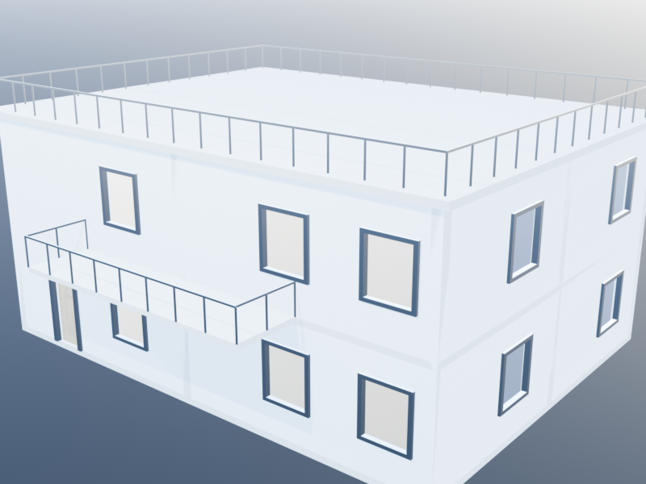
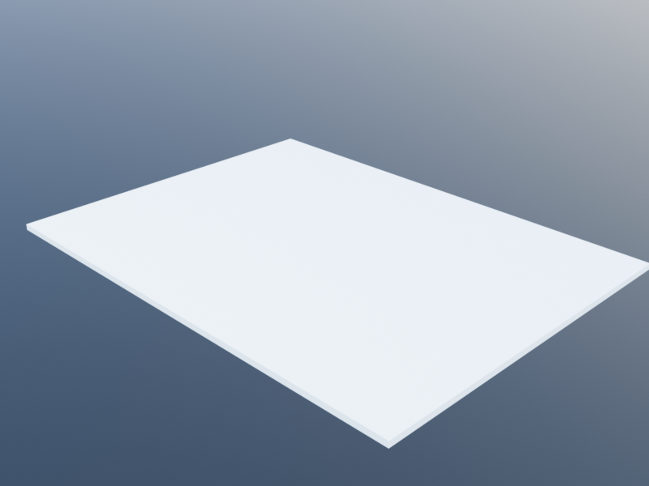
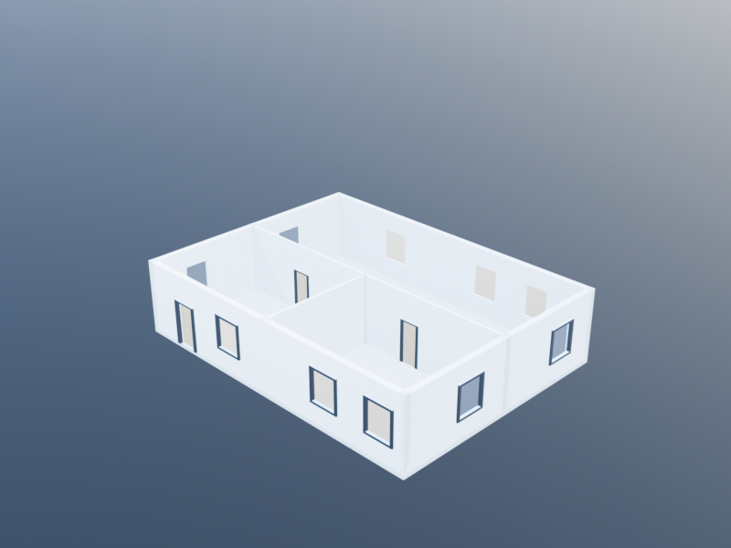
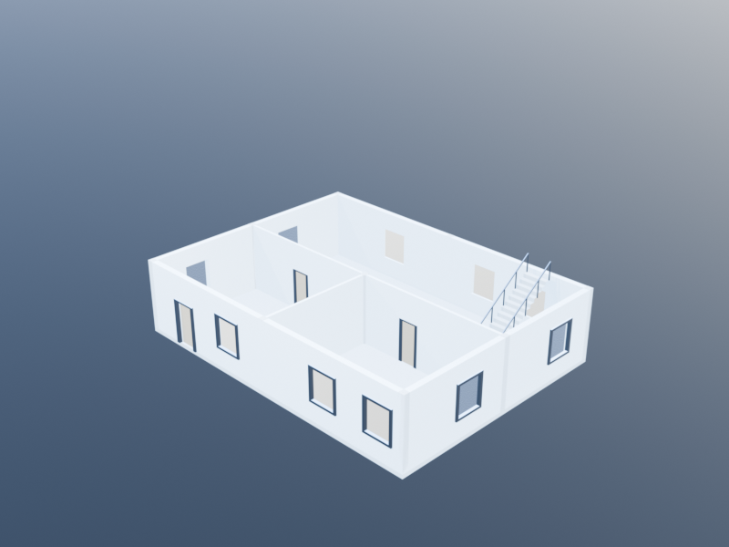
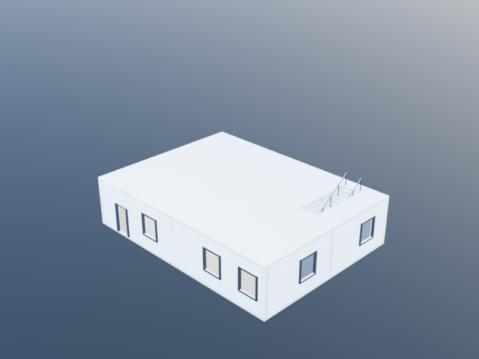
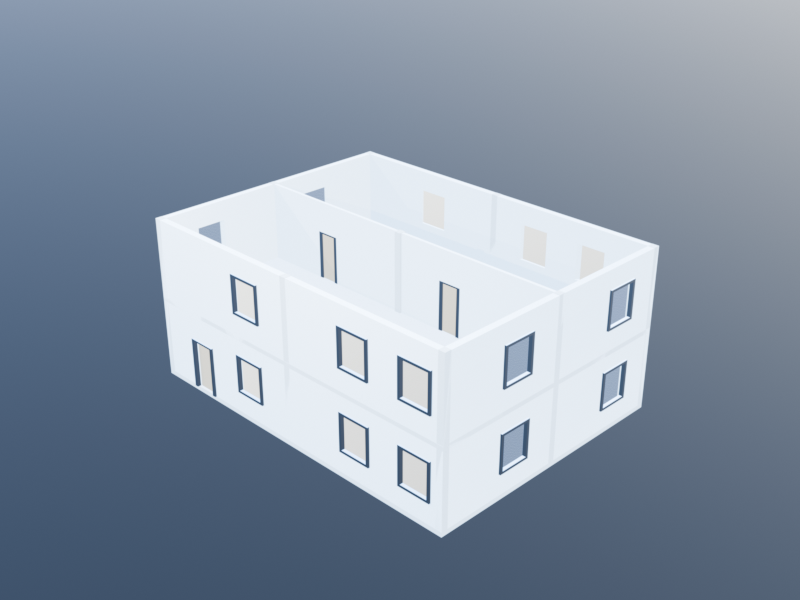
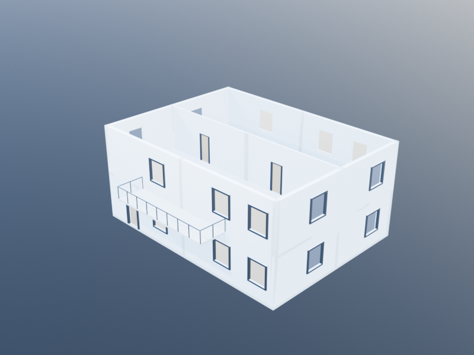
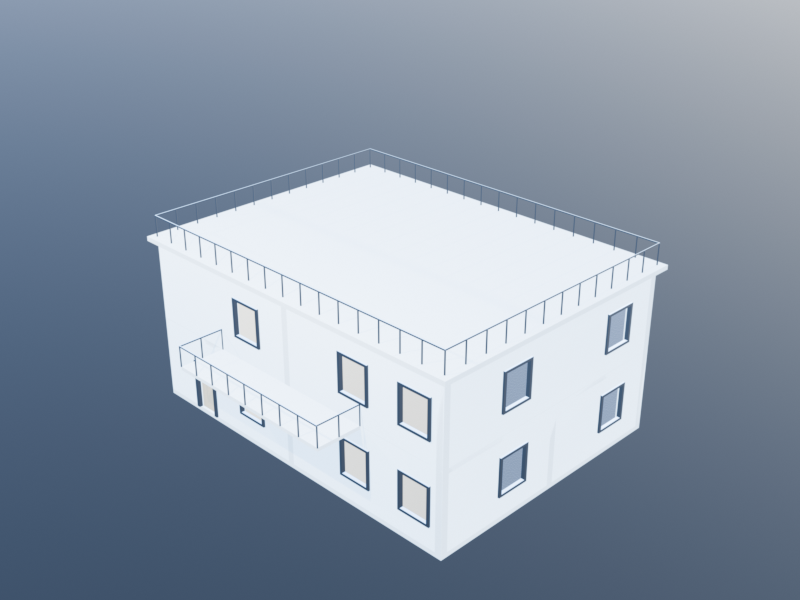

# Building a Complete Building

This tutorial walks through the creation of a 2-story office building using Khepri's BIM operations. The code is backend-portable -- change the `using` line to switch between any Khepri backend.

The finished building, rendered from a perspective camera with
interior lights and furnishings in place:



Every code block below adds one more layer of geometry; the
rendered result after each block appears inline as you work down
the page.

## Setup

```julia
using KhepriThebes   # or KhepriAutoCAD, KhepriRevit, KhepriTikZ, etc.

delete_all_shapes()
```

## Step 1: Define Levels

Every building starts with levels. We define three: ground floor, first floor, and roof.

```julia
ground      = level(0.0)
first_floor = level(3.5)
roof_level  = level(7.0)
```

## Step 2: Define Custom Families

Override default families to match the building's design intent.

```julia
# Exterior walls: 30cm thick
ext_wall = wall_family(thickness=0.3)

# Interior partitions: 15cm thick
int_wall = wall_family(thickness=0.15)

# Custom door and window sizes
main_door    = door_family(width=1.2, height=2.2)
office_door  = door_family(width=0.9, height=2.1)
tall_window  = window_family(width=1.4, height=1.6)
small_window = window_family(width=0.8, height=1.0)

# Structural columns
col_family = column_family(
  profile=rectangular_profile(0.3, 0.3))

# Stair with wider treads. `with_railings=true` is the high-level way to
# request a railing on each side of the stair: the stair body and the two
# railings are generated together by a single `stair(...)` call, with the
# railing paths and slope derived from the run, so they always stay
# aligned with the treads — no manual `railing(...)` calls needed.
office_stair = stair_family(
  width=1.2, riser_height=0.18, tread_depth=0.25,
  with_railings=true)
```

## Step 3: Ground Floor Structure

### Floor Slab

```julia
# Building footprint: 16m x 12m
building_region = rectangular_path(xy(0, 0), 16, 12)
slab(building_region, ground)
```



### Exterior Walls

Use a closed path for the building perimeter. The offset defaults to `1/2` for closed paths, placing wall thickness to the interior.

```julia
exterior = wall(
  closed_polygonal_path([
    xy(0, 0), xy(16, 0), xy(16, 12), xy(0, 12)]),
  ground, first_floor, ext_wall)
```


### Doors and Windows on Exterior Walls

Openings on a closed-path wall are placed by **arc-length** along the path. Starting at `xy(0, 0)` the loop walks south (paths 0–16), east (16–28), north (28–44), and west (44–56), so to clear the structural columns at world `x = 8` (south/north walls) and `y = 6` (east/west walls) we pick path positions that skip those grid lines.

```julia
# Front facade (south wall, y=0). Main entrance at x=2, windows at x=5,
# x=11, x=14 — all clear of the central column at (8, 0.15) and the
# interior partition wall meeting the exterior at x=8.
add_door(exterior, xy(2, 0), main_door)
add_window(exterior, xy(5, 1.0), tall_window)
add_window(exterior, xy(11, 1.0), tall_window)
add_window(exterior, xy(14, 1.0), tall_window)

# Right facade (east wall, x=16). Windows at y=3 and y=9 — between the
# corridor-wall column at (15.85, 6) and the corner columns.
add_window(exterior, xy(19, 1.0), tall_window)   # y = 19 - 16 = 3
add_window(exterior, xy(25, 1.0), tall_window)   # y = 25 - 16 = 9

# Back facade (north wall, y=12). Path indexing on the closed loop is
# right-to-left here, so x = 44 - path. Skip x=8 to clear the column
# at (8, 11.85).
add_window(exterior, xy(30, 1.0), tall_window)   # x = 44 - 30 = 14
add_window(exterior, xy(33, 1.0), tall_window)   # x = 44 - 33 = 11
add_window(exterior, xy(39, 1.0), tall_window)   # x = 44 - 39 = 5

# Left facade (west wall, x=0). Mirrors the east facade; y = 56 - path.
add_window(exterior, xy(47, 1.0), tall_window)   # y = 56 - 47 = 9
add_window(exterior, xy(53, 1.0), tall_window)   # y = 56 - 53 = 3
```


### Interior Partitions

```julia
# Corridor wall dividing the floor at y=6
corridor_wall = wall(
  open_polygonal_path([xy(0.3, 6), xy(15.7, 6)]),
  ground, first_floor, int_wall)

# Office dividers on south side
wall(open_polygonal_path([xy(8, 0.3), xy(8, 5.85)]),
     ground, first_floor, int_wall)

# Office doors
add_door(corridor_wall, xy(3, 0), office_door)   # left office
add_door(corridor_wall, xy(10, 0), office_door)  # right office
```


### Columns

```julia
# Columns at 8m spacing along the corridor
for x in [0.15, 8, 15.85]
  for y in [0.15, 6, 11.85]
    column(xy(x, y), 0, ground, first_floor, col_family)
  end
end
```



### Stairwell

`base_point` is the bottom-left corner when looking up the run (i.e. along `+direction`); with `direction = vy(1)` the stair body extends to the `+x` side of `base_point`. We place it in the north half of the building, between the corridor wall (`y = 6`) and the back exterior wall (`y = 12`), so it never escapes the footprint. The corresponding floor opening goes in with the first-floor slab in the next step.

Because the family was created with `with_railings=true`, the two side railings are emitted by the same `stair(...)` call and inherit the slope of the run — no separate `railing(...)` calls.

```julia
stair(xy(13, 6.5), vy(1), ground, first_floor, office_stair)
```



## Step 4: First Floor

### Floor Slab and Ceiling Below

The first-floor slab needs an opening over the stair, otherwise the stair would emerge into solid concrete. A `Region` constructed with an outer boundary plus one inner path produces a slab with a hole; we use the stair's own footprint (with a small margin) as the inner path, and apply the same shape to the ceiling so the ground-floor view up through the stairwell stays open as well.

```julia
# Stair occupies x ∈ [13, 14.2], y ∈ [6.5, 11.25]; widen the opening
# slightly on all sides so the slab edge clears the railing posts.
stairwell_opening = rectangular_path(xy(12.9, 6.4), 1.4, 4.85)

slab(region(building_region, stairwell_opening), first_floor)
ceiling(region(building_region, stairwell_opening), first_floor)
```



### Walls and Openings

The first floor has a similar layout. We repeat the pattern:

```julia
# Exterior walls
exterior_1f = wall(
  closed_polygonal_path([
    xy(0, 0), xy(16, 0), xy(16, 12), xy(0, 12)]),
  first_floor, roof_level, ext_wall)

# Windows on all facades (same path positions as the ground floor, which
# already avoid the column grid).
add_window(exterior_1f, xy(5, 1.0), tall_window)
add_window(exterior_1f, xy(11, 1.0), tall_window)
add_window(exterior_1f, xy(14, 1.0), tall_window)

add_window(exterior_1f, xy(19, 1.0), tall_window)
add_window(exterior_1f, xy(25, 1.0), tall_window)

add_window(exterior_1f, xy(30, 1.0), tall_window)
add_window(exterior_1f, xy(33, 1.0), tall_window)
add_window(exterior_1f, xy(39, 1.0), tall_window)

add_window(exterior_1f, xy(47, 1.0), tall_window)
add_window(exterior_1f, xy(53, 1.0), tall_window)

# Interior partitions
corridor_1f = wall(
  open_polygonal_path([xy(0.3, 6), xy(15.7, 6)]),
  first_floor, roof_level, int_wall)
add_door(corridor_1f, xy(3, 0), office_door)
add_door(corridor_1f, xy(10, 0), office_door)

# Columns
for x in [0.15, 8, 15.85]
  for y in [0.15, 6, 11.85]
    column(xy(x, y), 0, first_floor, roof_level, col_family)
  end
end
```



### Balcony with Railing

```julia
# Balcony slab extending from the south facade
balcony_region = rectangular_path(xy(4, -2), 8, 2)
slab(balcony_region, first_floor,
     slab_family(thickness=0.15))

# Railing around the balcony edge
railing(open_polygonal_path([
  xy(4, -2), xy(12, -2), xy(12, 0)]),
  first_floor)
railing(open_polygonal_path([xy(4, 0), xy(4, -2)]),
        first_floor)
```



## Step 5: Roof

```julia
# Roof slab with slight overhang
roof_region = rectangular_path(xy(-0.3, -0.3), 16.6, 12.6)
roof(roof_region, roof_level)

# Perimeter railing on the roof
railing(open_polygonal_path([
  xy(0, 0), xy(16, 0), xy(16, 12),
  xy(0, 12), xy(0, 0)]),
  roof_level,
  nothing,
  railing_family(height=1.1))
```



## Step 6: Interior Furnishings

```julia
# Ground floor reception: table and chairs
table_and_chairs(xy(4, 9), 0, ground)

# First floor conference room
conference = table_chair_family(
  table_family=table_family(length=2.4, width=1.0),
  chairs_top=1, chairs_bottom=1,
  chairs_right=3, chairs_left=3)
table_and_chairs(xy(4, 9), 0, first_floor, conference)

# Office desks
for (x, y) in [(3, 2), (3, 4), (10, 2), (10, 4)]
  table(xy(x, y), 0, ground, table_family(length=1.4, width=0.7))
  chair(xy(x, y - 0.6), 0, ground)
end
```


## Step 7: Lighting

```julia
# Ground floor ceiling lights
for x in 4:4:12, y in [3, 9]
  pointlight(xyz(x, y, 3.2), rgb(1, 0.98, 0.95), 800.0, ground)
end

# First floor ceiling lights
for x in 4:4:12, y in [3, 9]
  pointlight(xyz(x, y, 3.2), rgb(1, 0.98, 0.95), 800.0, first_floor)
end
```

## Step 8: Render

```julia
# Set camera position
set_view(xyz(25, -15, 12), xyz(8, 6, 3))

# Render the scene
render_view("office_building")
```

## Summary

This building uses the following BIM elements:

| Element | Count | Purpose |
|---------|-------|---------|
| `level` | 3 | Ground, first floor, roof |
| `slab` | 3+ | Floor plates, balcony |
| `roof` | 1 | Building roof |
| `ceiling` | 1 | Below first floor slab |
| `wall` | 6+ | Exterior and interior walls |
| `door` | 5 | Main entrance + office doors on both corridors |
| `window` | 20 | Facade glazing, placed to clear column grid |
| `column` | 18 | Structural grid |
| `stair` | 1 | Vertical circulation, auto-railed |
| `railing` | 5 | 2 auto-railings (stair) + 2 balcony + 1 roof perimeter |
| `table_and_chairs` | 2 | Reception and conference |
| `table` / `chair` | 8 | Office workstations |
| `pointlight` | 12+ | Interior lighting |

All elements are backend-portable. To render in a different backend, change only the `using` line at the top.
