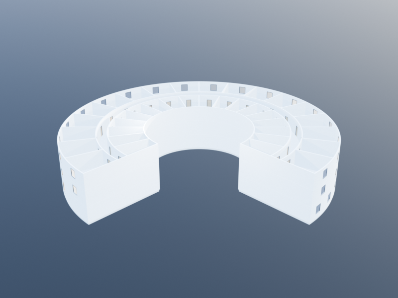
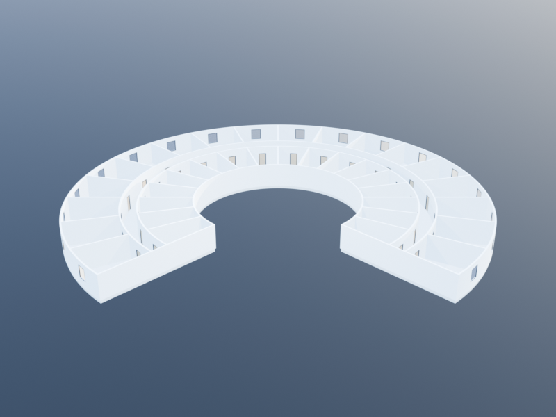
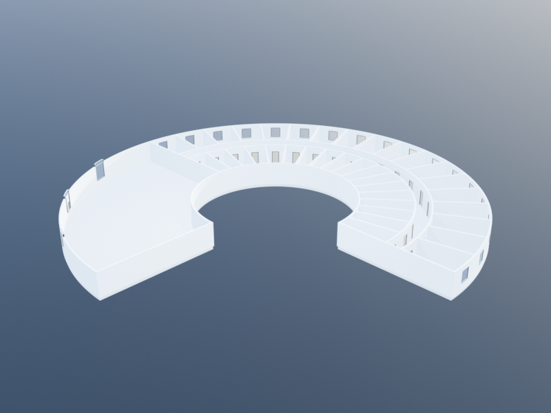
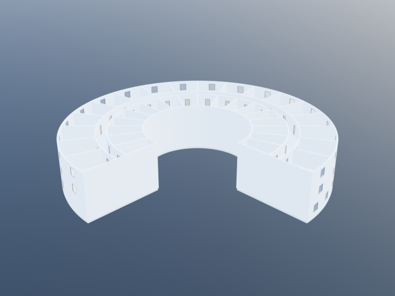

# Isenberg Bottom-Up

This tutorial builds the Isenberg School of Management Business Innovation
Hub — the arc-shaped BIG/Goody Clancy building whose "domino effect" copper
facade won the UNESCO Prix Versailles 2020 — using KhepriBase's
**Space-first Level-1 API**.

The finished three-storey result:



The same building is constructed by progressively declaring every
room as a first-class `Space`, composing them into a `Layout`, and
letting `build(layout)` emit walls, doors, windows, and slabs. The
sections below introduce one piece at a time; each code block is
followed by the rendering it produces, so you can see the geometry
land in place stage by stage.

The companion tutorial,
[Isenberg Top-Down](isemberg_top_down.md), builds the exact same
building from a [`polar_envelope`](@ref) plus radial and angular
subdivision operators. Comparing the two side-by-side is the cleanest
illustration of Level-1 vs Level-2 modelling.

## The shape in one picture

The Isenberg footprint is an arc-shaped band that sweeps from angle
`0` to `3π/2` around a courtyard:

- **Semicircular zone** (`0..π`): both the inner and outer boundaries
  are concentric circular arcs at radii `10` m and `25` m.
- **Projection zone** (`π..3π/2`): the outer boundary leaves the
  circle and extends along a tangent — we'll simplify that to a
  polar sector here, accepting a square-ish outer edge in the plan.
- **Three storeys** at 3 m each; the ground floor is kept open in the
  projection zone (entrance lobby).
- Each upper floor is divided into an **inner band of rooms**, a
  **circular corridor**, and an **outer band of rooms**.

The key primitive is [`polar_sector_path`](@ref): given a centre,
inner and outer radii, and two angles, it returns a `ClosedPath`
discretised into a polygon. Every `Space` we create in this tutorial
is bounded by one of those polygons.

## Parameters

Collect the numbers that drive the building. Changing any of these
regenerates the model in place.

```julia
using KhepriBase

center        = u0()
r_inner       = 10.0
r_outer       = 25.0
arc_start     = 0.0
projection    = π         # where the projection (open lobby) starts
arc_end       = 3π/2      # full 270° sweep

n_rooms       = 18        # rooms per band per floor (semicircular portion)
corridor_span = 2.0       # radial thickness of the corridor band, metres

floor_h       = 3.0       # floor-to-floor
n_floors      = 3
n_arc         = 0         # 0 = arc-native; >0 = polygon discretisation
```

The inner band covers roughly 40% of the radial span, the corridor
10%, and the outer band 50%. We compute those radii up front so
every room, wall, and corridor arc shares the same split:

```julia
# Inner/outer band radii with a 2 m corridor centred at the midpoint
r_mid           = (r_inner + r_outer) / 2
r_corridor_in   = r_mid - corridor_span / 2
r_corridor_out  = r_mid + corridor_span / 2
```

We'll also want an empty `Layout` to keep adding spaces to as we go.
Set one up with the wall and slab families the building uses
throughout:

```julia
plan = floor_plan(
  height = floor_h,
  wall_family = wall_family(thickness = 0.2),
  slab_family = slab_family(thickness = 0.4))
```

## Phase 1 — One polar sector

The smallest unit of geometry in the building is a single annular
wedge: a piece of the floor bounded by two concentric arcs and two
radial edges. `polar_sector_path` returns its boundary as a
`ClosedPath`, and `add_space` parks it on the layout as a named
`Space`. Calling `build(plan)` at this point emits the four walls and
one slab the wedge needs to stand up:

```julia
dθ = (arc_end - arc_start) / n_rooms

add_space(plan, "wedge",
  polar_sector_path(center, r_inner, r_corridor_in,
                    arc_start, arc_start + dθ;
                    n_arc = n_arc);
  kind = :office)

build(plan)
```


A single inner-band wedge appears at the eastern edge of the
courtyard. It carries two curved walls (inner and outer arcs) and
two straight radial walls, with a slab below.

## Phase 2 — Inner band of rooms

Repeat the same `add_space` call across the full `0..3π/2` sweep
and the wedge becomes a fan of `n_rooms` cells along the inner ring.
The radial walls between adjacent wedges are shared edges, so the
wall-graph chain resolver merges each pair of opposing radial walls
into one wall when `build` runs:

```julia
inner_rooms = [
  add_space(plan, "inner_$i",
    polar_sector_path(center, r_inner, r_corridor_in,
                      arc_start + (i - 1) * dθ,
                      arc_start +  i      * dθ;
                      n_arc = n_arc);
    kind = :office)
  for i in 1:n_rooms]

build(plan)
```


Eighteen inner offices wrap three-quarters of the way around the
courtyard. There is no corridor yet — this is just the inner ring.

## Phase 3 — The corridor band

Add one continuous arc-shaped `Space` between the inner ring and
the outer radius. It uses `n_arc * n_rooms` samples across its full
sweep so the long arc stays as smooth as the room arcs it sits next
to:

```julia
corridor = add_space(plan, "corridor",
  polar_sector_path(center, r_corridor_in, r_corridor_out,
                    arc_start, arc_end;
                    n_arc = n_arc * n_rooms);
  kind = :corridor)

build(plan)
```


A single curved corridor wraps around the inner ring of offices.
Where the corridor meets each inner room, the shared inner-arc
edge becomes one merged wall.

## Phase 4 — Outer band of rooms

The same comprehension as Phase 2, but on the outer side of the
corridor. The result is a classic double-loaded plan: rooms on
either side of a continuous spine:

```julia
outer_rooms = [
  add_space(plan, "outer_$i",
    polar_sector_path(center, r_corridor_out, r_outer,
                      arc_start + (i - 1) * dθ,
                      arc_start +  i      * dθ;
                      n_arc = n_arc);
    kind = :office)
  for i in 1:n_rooms]

build(plan)
```


The outer ring fills in. The plan now reads as inner-corridor-outer
across every angular wedge, with shared radial walls between
neighbouring rooms.

## Phase 5 — Doors and windows

Walls so far are unbroken. Two `add_door` loops cut a door from
each room onto the corridor (Khepri picks the midpoint of the
shared edge by default), and one `add_window` loop punches an
exterior window through the outer facade of every outer room:

```julia
for r in inner_rooms
  add_door(plan, r, corridor)
end
for r in outer_rooms
  add_door(plan, r, corridor)
end

for (i, r) in enumerate(outer_rooms)
  θ_mid = arc_start + (i - 0.5) * dθ
  add_window(plan, r, :exterior,
             loc = center + vpol(r_outer, θ_mid),
             family = window_family(width = 1.4, height = 1.5))
end

build(plan)
```



Door openings appear in the radial walls between rooms and the
corridor, and a band of identical windows ribbons the outer facade.
This is the complete generic upper-floor pattern.

## Phase 6 — Ground floor with lobby

The ground floor reuses the same pattern, but only across the
**semicircular** portion (`0..π`). The projection wedge
(`π..3π/2`) is left as one large entrance hall with a front door on
its outer facade and three big atrium windows. We collect Phases
2–5 (semicircular only) into a function so we can reuse it for the
upper floors later, then add the lobby pieces:

```julia
function add_upper_floor!(plan, theta_start, theta_end, n_rooms;
                          r_inner=r_inner, r_outer=r_outer,
                          r_corridor_in=r_corridor_in,
                          r_corridor_out=r_corridor_out,
                          n_arc=n_arc)
  dθ = (theta_end - theta_start) / n_rooms
  inner_rooms = [
    add_space(plan, "inner_$i",
      polar_sector_path(center, r_inner, r_corridor_in,
                        theta_start + (i - 1) * dθ,
                        theta_start +  i      * dθ;
                        n_arc=n_arc);
      kind = :office)
    for i in 1:n_rooms]
  corridor = add_space(plan, "corridor",
    polar_sector_path(center, r_corridor_in, r_corridor_out,
                      theta_start, theta_end; n_arc=n_arc * n_rooms);
    kind = :corridor)
  outer_rooms = [
    add_space(plan, "outer_$i",
      polar_sector_path(center, r_corridor_out, r_outer,
                        theta_start + (i - 1) * dθ,
                        theta_start +  i      * dθ;
                        n_arc=n_arc);
      kind = :office)
    for i in 1:n_rooms]
  for r in inner_rooms;  add_door(plan, r, corridor); end
  for r in outer_rooms;  add_door(plan, r, corridor); end
  for (i, r) in enumerate(outer_rooms)
    θ_mid = theta_start + (i - 0.5) * dθ
    add_window(plan, r, :exterior,
               loc = center + vpol(r_outer, θ_mid),
               family = window_family(width=1.4, height=1.5))
  end
  (inner_rooms, corridor, outer_rooms)
end

function add_ground_floor!(plan)
  inner_rooms, corridor, outer_rooms =
    add_upper_floor!(plan, arc_start, projection, n_rooms)

  lobby = add_space(plan, "lobby",
    polar_sector_path(center, r_inner, r_outer,
                      projection, arc_end; n_arc=n_arc * 6);
    kind = :lobby)

  # Front door at the far end of the projection, on the outer edge
  θ_door = (projection + arc_end) / 2
  add_door(plan, lobby, :exterior,
           loc = center + vpol(r_outer, θ_door))

  # Big atrium windows along the lobby's outer facade
  for t in (0.25, 0.5, 0.75)
    θ = projection + t * (arc_end - projection)
    add_window(plan, lobby, :exterior,
               loc = center + vpol(r_outer, θ),
               family = window_family(width=1.8, height=2.4))
  end
  (inner_rooms, corridor, outer_rooms, lobby)
end

add_ground_floor!(plan)
build(plan)
```



Half the building is rooms-and-corridor; the projection wedge is
one continuous lobby with a wide front door and three tall atrium
windows facing south.

Two things to notice in `add_upper_floor!`:

- **`n_arc` scaling.** The individual room arcs are discretised
  with `n_arc` per room; the corridor uses `n_arc * n_rooms`
  samples across its full sweep so the single long arc stays smooth.
- **Spaces are handles.** Each `add_space` call *creates* one
  `Space` on the layout and returns it — we feed those handles
  straight into `add_door` / `add_window`.

## Phase 7 — Stack three storeys

`add_storey!` stacks an additional storey on top of the layout's
current top. Loop over the upper-floor count, calling
`add_upper_floor!` with the **full** sweep each time, and finish
with `build`:

```julia
plan = floor_plan(
  height = floor_h,
  wall_family = wall_family(thickness = 0.2),
  slab_family = slab_family(thickness = 0.4))

add_ground_floor!(plan)

for _ in 2:n_floors
  add_storey!(plan; height = floor_h)
  add_upper_floor!(plan, arc_start, arc_end, n_rooms)
end

walls, doors, windows, slabs = build(plan)
```



The complete three-storey building. At this point `plan` is a
multi-storey `Layout` with `(2 n_rooms + 1) × (n_floors - 1) + (2
n_rooms + 2)` spaces — one corridor per floor, one inner and outer
room per angular wedge per floor, plus the ground-floor lobby.

`build` compiles every storey through the wall-graph chain resolver
(so shared curved edges are merged into single walls with mitred
corners at the radial partitions) and emits:

- one wall per shared edge, classified as interior or exterior;
- one door per `add_door` call;
- one window per `add_window` call, at the default 0.9 m sill;
- one slab per room per storey, plus a roof at the top.

## Rendering

Any Khepri backend can render the result. For a quick textual summary:

```julia
realize(plan, TextBackend())
```

For CAD:

```julia
using KhepriAutoCAD; autocad()
realize(plan)
```

## What this approach is good at

- **Imperative control.** Every room is a named handle; every door
  ties two of those handles together by identity. Adding an exit, a
  special-purpose mechanical room, or a localised override is one
  extra line.
- **Heterogeneous geometry.** Non-uniform rooms, off-grid carves,
  mid-wing bays that don't align to the circular partition — all
  drop in as one more `add_space` call.
- **No tree to walk.** `build` iterates the flat list of storeys and
  spaces; there's nothing to re-parse when you change a room.

## What the top-down approach does better

- **Uniform rooms from one declaration.** The inner and outer bands
  in this tutorial are built by two nearly identical comprehensions.
  The top-down version expresses "split the envelope radially into
  three bands, then partition each band into `n_rooms` wedges" as a
  single pipeline of subdivision operators — see the companion
  [Isenberg Top-Down](isemberg_top_down.md) tutorial.

## Exercises

1. **Asymmetric rooms.** Change the projection to `5π/4` and regenerate.
   The semicircular span shrinks and the lobby grows.

2. **Double-loaded corridor with offices only on the outer band.**
   Drop the `inner_rooms` comprehension and widen `r_corridor_in` so
   the corridor reaches the inner facade. Add a courtyard-facing
   window to each outer room's angular mid-line.

3. **Fire-stair.** Inject a stair space at `(θ = 5π/4, r = r_corridor_in)`
   on every floor by adding a `:stair` space with a small angular
   width and calling `add_door(plan, stair, :exterior, loc=…)` to
   pierce the outer facade.
