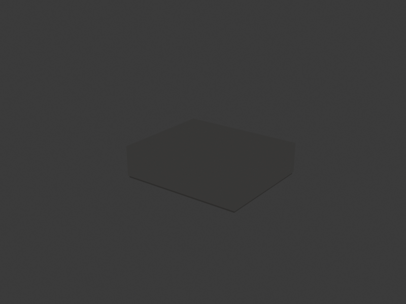

# Isenberg Top-Down

This tutorial builds the same arc-shaped Isenberg School of Management
Business Innovation Hub as the companion
[Isenberg Bottom-Up](isemberg_bottom_up.md) tutorial — but the
**geometry is declared top-down** as a tree of `SpaceDesc` nodes
rather than constructed room by room.

The same plan produced by a top-down recipe:



The centrepiece is [`polar_envelope`](@ref): a `SpaceDesc` leaf that
describes an annular-sector volume around a centre point. Once you
have an envelope, the usual subdivision operators apply:

- [`subdivide_radial`](@ref) and [`subdivide_angular`](@ref) split an
  envelope into concentric bands or angular wedges by proportional
  ratios.
- [`partition_angular`](@ref) and [`partition_radial`](@ref) split an
  envelope into equal parts along one axis.
- [`refine`](@ref) and [`assign`](@ref) drill into a named zone of a
  subdivision — `refine` receives a fresh `polar_envelope` sized to
  the zone, so polar subdivision composes recursively just like
  rectangular subdivision does.
- [`above`](@ref) stacks two subtrees vertically; polar subtrees
  ignore the Cartesian `(x, y)` cursor and thread only `z`, so
  stacking floors works without any coordinate gymnastics.

See [Top-Down Subdivision](@ref) for the rectangular analogues of
these operators — the polar versions follow the exact same pattern.

## Parameters

```julia
using KhepriBase

center        = u0()
r_inner       = 10.0
r_outer       = 25.0
arc_start     = 0.0
projection    = π        # where the ground-floor lobby begins
arc_end       = 3π/2

n_rooms       = 18       # angular wedges per band per floor
corridor_span = 2.0      # radial thickness of the corridor band

floor_h       = 3.0
n_floors      = 3
n_arc         = 0        # 0 = arc-native; >0 = polygonal fallback
```

The `n_arc` parameter controls how each polar sector's arcs are
represented. The default, `n_arc = 0`, keeps them as true circular
arcs (`ArcPath` under the hood) — the wall-graph classifier uses
`cocircular_overlap` to find shared sub-arcs between neighbouring
sectors, the resolver merges co-circular runs into single
`ArcPath` walls, and BIM backends (AutoCAD, Revit) emit native
curved walls instead of polyline approximations. Passing `n_arc >
0` forces polygonal discretisation (each arc becomes `n_arc` line
segments) — useful for non-BIM backends that can't render curves,
or for comparing against the legacy output.

The radial split is expressed directly as proportions. The inner band
gets roughly 40% of the radial span, the corridor 10%, the outer band
50%:

```julia
r_span    = r_outer - r_inner
inner_p   = ((r_span - corridor_span) / 2) / r_span
outer_p   = inner_p
corridor_p = corridor_span / r_span
# (inner_p, corridor_p, outer_p) ≈ (0.43, 0.13, 0.43), and sum to 1
```

## The upper-floor description

An upper floor is a polar envelope spanning the full arc, split
radially into three bands, with the inner and outer bands further
partitioned into `n_rooms` angular wedges. The corridor zone is
assigned the `:corridor` kind so downstream tools can find it by
name.

```julia
upper_floor() =
  polar_envelope(center, r_inner, r_outer, arc_start, arc_end, floor_h;
                 id = :floor, n_arc = n_arc) |>
  d -> subdivide_radial(d,
         [inner_p, corridor_p, outer_p],
         [:inner_band, :corridor_band, :outer_band]) |>
  d -> refine(d, :inner_band,
              inner -> partition_angular(inner, n_rooms, :inner)) |>
  d -> refine(d, :outer_band,
              outer -> partition_angular(outer, n_rooms, :outer)) |>
  d -> refine(d, :corridor_band,
              corr -> partition_angular(corr, n_rooms, :corridor))
```

The corridor band is partitioned angularly into `n_rooms` wedges
too, rather than left as one long arc. That keeps every sector's
polygon discretisation aligned — each room and its facing corridor
slice share the same vertex on the intermediate radius, so the
adjacency detector classifies the edge as shared and `build` emits
a single wall between them.

Every one of those pipe stages returns a new `SpaceDesc`, so the
expression reads top-to-bottom like a spec:

> take the polar envelope, split it radially into three bands, refine
> the inner band into angular partitions, refine the outer band the
> same way, label the middle band as the corridor.

## The ground floor

The ground floor is the same envelope, but the projection zone (the
outer wedge beyond `π`) is left open as the entrance lobby rather
than filled with rooms. That is expressed as an **angular
subdivision first**, then the usual radial split applied only to the
semicircular piece.

```julia
ground_floor() =
  polar_envelope(center, r_inner, r_outer, arc_start, arc_end, floor_h;
                 id = :ground, n_arc = n_arc) |>
  d -> subdivide_angular(d,
         [(projection - arc_start) / (arc_end - arc_start),
          (arc_end - projection) / (arc_end - arc_start)],
         [:semi, :projection]) |>
  d -> refine(d, :semi,
              semi -> subdivide_radial(semi,
                       [inner_p, corridor_p, outer_p],
                       [:inner_band, :corridor_band, :outer_band]) |>
                     dd -> refine(dd, :inner_band,
                                  inner -> partition_angular(inner, n_rooms, :inner)) |>
                     dd -> refine(dd, :outer_band,
                                  outer -> partition_angular(outer, n_rooms, :outer)) |>
                     dd -> refine(dd, :corridor_band,
                                  corr -> partition_angular(corr, n_rooms, :corridor))) |>
  d -> assign(d, :projection, :lobby)
```

The inner refinement `semi -> …` mirrors `upper_floor` exactly:
angular partition only runs over the semicircular span, with the
polar envelope handed in by `refine` carrying the reduced
`theta_start..theta_end` range.

## Stacking the storeys

The upper-floor description uses the same room ids on every floor
(`inner_1..inner_n`, `outer_1..outer_n`, …), so stacking two copies
verbatim would collide on the id dictionary. [`repeat_unit`](@ref)
with `axis = :z` solves that: each copy is placed at the next storey
elevation and its placed spaces are scoped under a `unit_i/` prefix
so ids stay unique.

```julia
uppers   = repeat_unit(upper_floor(), n_floors - 1; axis = :z)
building = ground_floor() ^ uppers
plan     = layout(building)
```

`plan` is a three-storey `Layout`. The ground storey carries `2 *
n_rooms + 2` spaces — inner and outer rooms on the semicircular half,
the `corridor_band`, and the `projection` lobby. Each upper storey
carries `2 * n_rooms + 1` spaces, addressable under the `unit_1/`
and `unit_2/` prefixes.

## Adding connections

Geometry declared top-down still needs door and window placement, and
that is the natural place to drop back to the Level-1 API. The
placed spaces are addressable by name via [`find_space`](@ref), and
[`add_door`](@ref) / [`add_window`](@ref) take those handles.

The placed ids carry scope. The ground floor's rooms come out of
`refine`, which replaces a zone in-place rather than introducing a
new prefix — so ids stay flat (`:inner_5`, `:corridor_5`). The
upper floors come out of `repeat_unit(…; axis=:z)`, which *does*
inject a unit prefix (`:unit_1/inner_5`). A small helper per storey
bridges the two:

```julia
storey_prefix(i) = i == 1 ? "" : "unit_$(i - 1)/"

for (i, _) in enumerate(plan.storeys)
  pref = storey_prefix(i)

  # Doors: every inner and outer room onto its corresponding corridor slice
  for j in 1:n_rooms
    corr  = find_space(plan, Symbol(pref, "corridor_", j))
    inner = find_space(plan, Symbol(pref, "inner_",    j))
    outer = find_space(plan, Symbol(pref, "outer_",    j))
    isnothing(corr) && continue
    isnothing(inner) || add_door(plan, inner, corr)
    isnothing(outer) || add_door(plan, outer, corr)
  end

  # Glue corridor slices to each other so the corridor reads as one path
  for j in 1:(n_rooms - 1)
    ca = find_space(plan, Symbol(pref, "corridor_", j))
    cb = find_space(plan, Symbol(pref, "corridor_", j + 1))
    (isnothing(ca) || isnothing(cb)) && continue
    add_arch(plan, ca, cb)
  end

  # Exterior windows on every outer room
  for j in 1:n_rooms
    sp = find_space(plan, Symbol(pref, "outer_", j))
    isnothing(sp) && continue
    p = sp.props._polar
    θ_mid = (p.theta_start + p.theta_end) / 2
    add_window(plan, sp, :exterior,
               loc = center + vpol(r_outer, θ_mid),
               family = window_family(width=1.4, height=1.5))
  end
end

# Front door on the lobby's outer facade
lobby = find_space(plan, :projection)
θ_door = (projection + arc_end) / 2
add_door(plan, lobby, :exterior, loc = center + vpol(r_outer, θ_door))
```

[`add_arch`](@ref) between adjacent corridor slices suppresses the
wall that would otherwise separate them — the build step emits one
continuous chain of wall along the radial partition between any two
corridor pieces where no arch is declared, and nothing at all
between arched neighbours.

The Space carries its own polar metadata in `sp.props._polar` — the
same `(center, r_inner, r_outer, theta_start, theta_end, n_arc)`
tuple the envelope was built from — so downstream code can reason
about *where* the space lives without re-parsing the SpaceDesc tree.

## Build

```julia
walls, doors, windows, slabs = build(plan)
realize(plan, TextBackend())   # or realize(plan) once a Khepri backend is active
```

`build` compiles every storey through the wall-graph chain resolver,
producing one wall per shared edge (curved and radial alike), one
door per `add_door`, one window per `add_window` at the default
0.9 m sill, and one slab per room.

## What this approach is good at

- **Uniform rooms from one declaration.** `partition_angular(inner,
  n_rooms, :inner)` produces eighteen identical wedges from a single
  line. Changing `n_rooms` reshapes the entire building.
- **Recursive structure.** The ground floor reuses the same
  inner-band / corridor / outer-band subdivision as the upper
  floors, nested inside an angular carve-out for the lobby.
  `refine` makes that nesting transparent: the inner subtree sees a
  polar envelope and doesn't care where it came from.
- **One tree, one shape.** The whole building's geometry is a
  single `SpaceDesc` value. Passing a different value to `layout`
  gives a different building — great for generating families of
  variants the way the original Isenberg tutorial does with
  parametric variations.

## What the bottom-up approach does better

- **Room-by-room overrides.** A mechanical room at a specific angular
  position, a stair that only exists on certain floors, or a pair of
  neighbouring rooms with a shared sliding wall — all much easier to
  express as one more `add_space` call than as a special case in the
  subdivision tree. The
  [Isenberg Bottom-Up](isemberg_bottom_up.md) tutorial shows that
  pattern.

## Exercises

1. **Asymmetric wings.** Change the inner-band angular partition to
   `partition_angular(inner, 12, :inner)` while the outer band
   stays at `n_rooms`, giving larger rooms on the courtyard side.

2. **Double radial corridor.** Replace the three-band
   `subdivide_radial` with a five-band split
   `[0.3, 0.1, 0.2, 0.1, 0.3]` and assign both narrow bands to
   `:corridor`, producing a double-loaded building with two
   corridors.

3. **Projection-with-rooms.** In `ground_floor()`, drop the final
   `assign(:projection, :lobby)` and instead refine the projection
   with the same `inner_band / corridor_band / outer_band`
   subdivision used on upper floors. The lobby disappears; the
   projection zone is now a third band of rooms.
