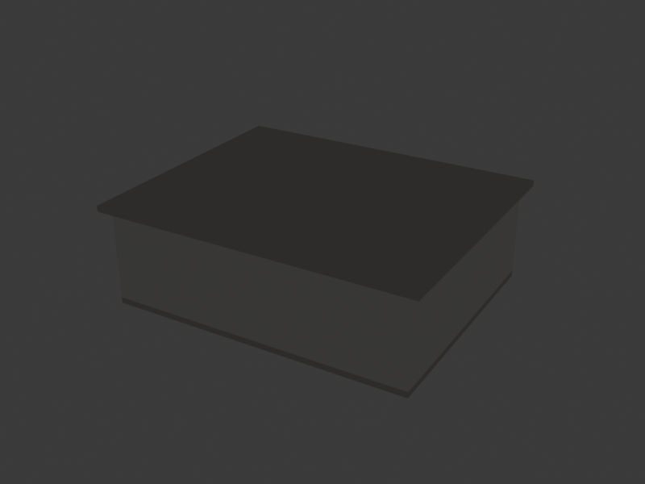
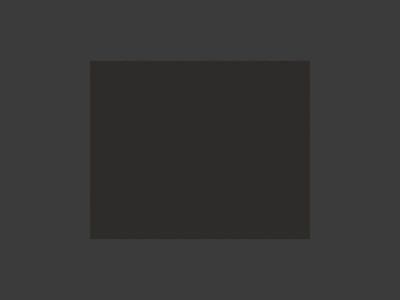

# Rendering and Animation Tutorial

This tutorial covers how to configure rendering parameters, set up camera views,
produce rendered images, and create animated films using Khepri's camera and
rendering system.

The same scene rendered from four camera positions — isometric, top, front, and close-up:

| Isometric | Top |
|:---:|:---:|
|  |  |

| Front | Close-up |
|:---:|:---:|
|  |  |

## Render Parameters

Khepri uses a set of global `Parameter` values to control the output of rendered
images. You can read the current value by calling the parameter with no
arguments and set a new value by passing one:

```julia
render_width()          # returns current width (default 1024)
render_width(800)       # sets width to 800

render_height()         # returns current height (default 768)
render_height(600)      # sets height to 600
```

You can also set both dimensions at once with `render_size`:

```julia
render_size(800, 600)   # sets width=800, height=600
```

Two additional parameters affect image quality and exposure:

```julia
render_quality(0.5)     # range [-1, 1], higher is better
render_exposure(1.0)    # range [-3, +3], adjusts brightness
```

### Output Directory

Rendered images are saved to a path assembled from several directory parameters:

```julia
render_dir("/path/to/output")       # base directory (default: homedir())
render_user_dir("MyProject")        # user subdirectory (default: ".")
render_backend_dir("POVRay")        # backend subdirectory (default: ".")
render_kind_dir("Render")           # kind subdirectory (default: "Render")
render_color_dir(".")               # color subdirectory (default: ".")
render_ext(".png")                  # file extension (default: ".png")
```

The full output path for a render named `"my_render"` is computed by
`render_default_pathname("my_render")`, which joins all these components with
`joinpath` and normalizes the result.

You can temporarily override several parameters at once using `rendering_with`:

```julia
rendering_with(width=1920, height=1080, quality=0.8) do
  set_view(xyz(30, 30, 20), xyz(0, 0, 0))
  render_view("high_res_render")
end
```

## Setting the View

Before rendering, position the camera by calling `set_view`:

```julia
set_view(camera::Loc, target::Loc, lens::Real=50, aperture::Real=32)
```

- `camera` -- the location of the camera in world coordinates.
- `target` -- the point the camera looks at.
- `lens` -- the focal length in millimeters (default 50). Smaller values give a
  wider field of view; larger values zoom in.
- `aperture` -- controls depth of field (default 32).

Example:

```julia
set_view(xyz(50, 50, 30), xyz(0, 0, 0))            # default lens
set_view(xyz(50, 50, 30), xyz(0, 0, 0), 35, 16)    # wide-angle, shallow DOF
```

You can retrieve the current view with `get_view()`, which returns the camera
location, target location, and lens value.

The helper `view_angles` computes horizontal and vertical field-of-view angles
from the current lens and render dimensions:

```julia
h_angle, v_angle = view_angles()                   # uses defaults
h_angle, v_angle = view_angles(35, 1920, 1080)     # explicit values
```

There is also a convenience function to reset to a top-down view:

```julia
set_view_top()
```

## Rendering

### Render Setup

Before rendering, you should call `render_setup` to configure the render style.
The `render_kind` parameter accepts one of three symbols:

| Symbol       | Description                                          |
|--------------|------------------------------------------------------|
| `:realistic` | Full-color realistic rendering (the default)         |
| `:white`     | Clay-model style on a white background               |
| `:black`     | Clay-model style on a black background               |

```julia
render_setup(:white)       # configure for a white clay render
```

This sets `render_kind` and `render_kind_dir` appropriately, and calls the
backend's initial setup routine.

### Producing a Render

Call `render_view` to produce the image (always set the view first so the
camera points at the relevant geometry):

```julia
set_view(xyz(20, 20, 15), xyz(0, 0, 0))
render_view("my_render")
```

This delegates to the active backend, which writes the image file to the path
determined by the render parameters. The default name is `"View"` if you call
`render_view()` with no argument.

The convenience function `to_render` deletes all existing shapes, calls a
function to create new geometry, and then renders:

```julia
to_render("scene_01") do
  sphere(xyz(0, 0, 1), 2)
  box(xyz(5, 0, 0), 3, 3, 3)
  set_view(xyz(15, -10, 8), xyz(2, 0, 1))
end
```

## Film and Animation Workflow

Khepri supports frame-by-frame animation. The workflow is:

1. Start a film with a name.
2. For each frame, set the camera view and call `save_film_frame()`.
3. Finish the film to produce a video file.

### Starting and Finishing a Film

```julia
start_film("my_animation")
```

This activates film mode (`film_active(true)`), sets the film name, and resets
the frame counter to 0.

After all frames have been saved:

```julia
finish_film()
```

This deactivates film mode and calls `create_mp4_from_frames` to assemble the
frames into an MP4 video using `ffmpeg`.

### Saving Frames

Each call to `save_film_frame()` renders the current view and increments the
frame counter. Frames are saved with filenames like
`"my_animation-frame-000.png"`, `"my_animation-frame-001.png"`, etc., under the
`"Film"` subdirectory.

```julia
save_film_frame()
```

You can pass an object to `save_film_frame` and it will be returned, which is
useful for chaining. The `saving_film_frames` parameter (default `true`) can be
set to `false` to skip actual rendering during debugging, replacing it with a
short `sleep(0.1)`.

The convenience function `to_film` combines `start_film` with a user function:

```julia
to_film("orbit_animation") do
  # ... generate frames here
end
```

## Camera Motion Functions

Khepri provides several high-level functions for common camera movements. Each
one calls `set_view_save_frame` internally, so they must be used inside a film
session (between `start_film` and `finish_film`).

### track_still_target -- Orbit Around a Fixed Point

```julia
track_still_target(camera_path, target, lens=default_lens(), aperture=default_aperture())
```

The camera moves along a list of positions while always looking at a fixed
target. The number of positions in `camera_path` determines the number of
frames.

```julia
start_film("orbit")
let target = xyz(0, 0, 0),
    cameras = [xyz(20*cos(a), 20*sin(a), 10) for a in division(0, 2pi, 60, false)]
  track_still_target(cameras, target)
end
finish_film()
```

### walkthrough -- Camera and Target Move Along a Path

```julia
walkthrough(path, camera_spread, lens=default_lens(), aperture=default_aperture())
```

Both the camera and the target travel along the same path of locations, but the
camera trails behind the target by `camera_spread` positions. The camera looks
at a point `camera_spread` steps ahead on the path.

```julia
start_film("hallway_walk")
let path = [xyz(0, i, 1.7) for i in division(0, 50, 120)]
  walkthrough(path, 5)
end
finish_film()
```

### panning -- Fixed Camera, Moving Target

```julia
panning(camera, targets, lens=default_lens(), aperture=default_aperture())
```

The camera stays in one place while the target sweeps across a list of
positions, creating a panning effect.

```julia
start_film("pan_across")
let camera = xyz(0, -20, 5),
    targets = [xyz(x, 0, 2) for x in division(-15, 15, 60)]
  panning(camera, targets)
end
finish_film()
```

### lens_zoom -- Zoom by Changing Focal Length

```julia
lens_zoom(camera, target, delta, frames, lens=default_lens(), aperture=default_aperture())
```

The camera and target remain fixed while the lens focal length changes
incrementally. The `delta` value is the step size: positive values zoom in,
negative values zoom out. The `frames` parameter sets the number of frames.

```julia
start_film("zoom_in")
lens_zoom(xyz(30, 30, 15), xyz(0, 0, 0), 2, 40)
finish_film()
```

### dolly_effect_back / dolly_effect_forth -- Dolly Zoom

The dolly zoom (also known as the Vertigo effect) moves the camera while
simultaneously adjusting the lens to keep the target the same apparent size.

```julia
dolly_effect_back(delta, camera, target, lens, frames)
dolly_effect_forth(delta, camera, target, lens, frames)
```

- `delta` -- the distance the camera moves per frame.
- `dolly_effect_back` moves the camera away from the target while increasing
  the focal length.
- `dolly_effect_forth` moves the camera toward the target while decreasing
  the focal length.

```julia
start_film("vertigo")
dolly_effect_back(0.3, xyz(10, 0, 3), xyz(0, 0, 3), 30, 60)
finish_film()
```

### track_moving_target -- Camera Follows a Moving Target

```julia
track_moving_target(camera, targets, lens=default_lens(), aperture=default_aperture())
```

The camera maintains a constant offset from the target as both move. The offset
is computed from the initial camera position and the first target position.

## Complete Example

The following example builds a simple scene, renders a still image, and then
creates an orbital animation around it.

```julia
# Build the scene
delete_all_shapes()
box(xyz(0, 0, 0), 4, 4, 4)
sphere(xyz(0, 0, 6), 2)
cylinder(xyz(8, 0, 0), 1.5, 5)

# Configure rendering
render_size(800, 600)
render_dir(homedir())

# Render a still image
render_setup(:realistic)
set_view(xyz(25, 25, 15), xyz(0, 0, 3), 50)
render_view("still_shot")

# Create an orbital animation
start_film("orbit_demo")
let target = xyz(0, 0, 3),
    n_frames = 90,
    radius = 25,
    cameras = [xyz(radius*cos(a), radius*sin(a), 15)
               for a in division(0, 2pi, n_frames, false)]
  track_still_target(cameras, target, 50)
end
finish_film()
```

The still image is saved as `still_shot.png` under the render directory. The
animation frames are saved under a `Film` subdirectory, and `finish_film`
produces an MP4 video from those frames.

## See Also

- [Camera & Rendering Reference](../reference/camera_rendering.md) -- full API
  reference for all rendering parameters and functions.
- [Coordinates](../getting_started/coordinates.md) -- how to work with
  locations and vectors used for camera positioning.
