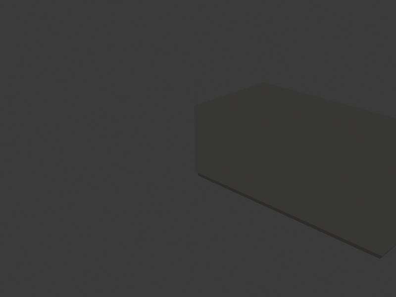
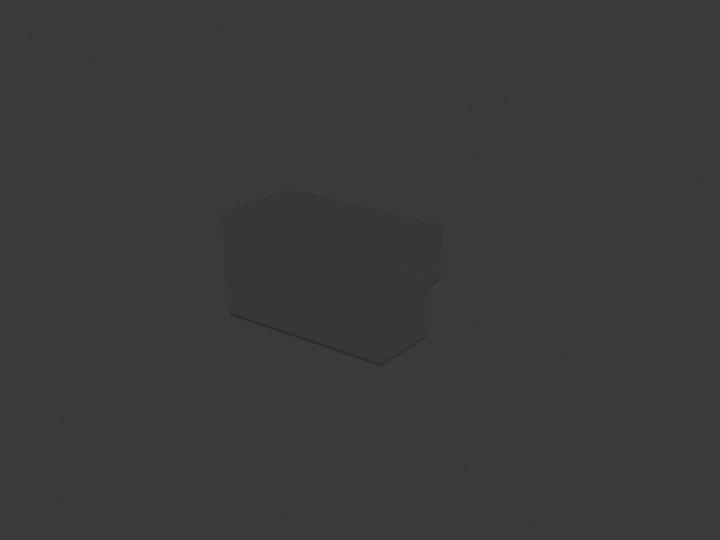

# Space-First Layout Design

Traditional BIM modeling requires the architect to create each wall, position each
door and window along it, and manually manage shared boundaries between adjacent
rooms. This becomes tedious and error-prone, especially for algorithmically-generated
layouts where rooms are computed rather than drawn by hand.

The **Spaces** module inverts this workflow: you define *spaces* (rooms) as
closed polygonal areas and declare *connections* (doors, windows, arches) between
them. A single call to `build()` generates all the walls, doors, windows, and
floor slabs automatically. Shared walls between adjacent rooms are detected and
built only once, doors are centered on the shared edge, and exterior walls are
placed around the perimeter. Internally, `build()` uses a
[WallGraph](../bim/wall_graph.md) to merge adjacent wall segments into
multi-vertex paths with proper corner miters and T-junction geometry.

Starting from two adjacent rooms and growing out:

| Two rooms | Four rooms | Two storeys |
|:---:|:---:|:---:|
|  |  |  |

After building, the result can be *introspected*: which walls bound a room, which
spaces share a door, what is the area of each room. Validation rules can check
construction regulations --- minimum areas, mandatory doors, maximum room sizes ---
before the design is sent to a backend for visualization.

## Setup

```julia
using KhepriAutoCAD   # or any Khepri backend (re-exports KhepriBase)

delete_all_shapes()
```

## A First Example: Two Rooms with a Door

The simplest floor plan has two rooms and a door between them.

```julia
plan = floor_plan()

room_a = add_space(plan, "Room A", rectangular_path(u0(), 5, 4))
room_b = add_space(plan, "Room B", rectangular_path(xy(5, 0), 5, 4))

add_door(plan, room_a, room_b)

build(plan)
```

`floor_plan()` creates an empty plan with default level, height, wall, and slab
families. `add_space` registers a named space defined by a closed path ---
here, two 5x4 rectangles sharing the edge at x=5. `add_door` declares a door
between them, and `build` does all the work: it detects the shared edge, creates
one interior wall there, creates exterior walls around the perimeter, places the
door centered on the shared wall, and generates floor slabs for both rooms.

## Designing a House

Let us design a small single-story house with a living room, kitchen, two
bedrooms, a bathroom, and a corridor connecting them.

### Step 1: The Floor Plan

```julia
plan = floor_plan(
  height=2.8,
  wall_family=wall_family(thickness=0.2),
  slab_family=slab_family(thickness=0.25))
```

### Step 2: Define the Spaces

We lay out the rooms on a grid. The `kind` keyword classifies each space for
later validation.

```julia
# South wing: living room and kitchen
living = add_space(plan, "Living Room",
  closed_polygonal_path([xy(0,0), xy(6,0), xy(6,5), xy(0,5)]),
  kind=:room)

kitchen = add_space(plan, "Kitchen",
  closed_polygonal_path([xy(6,0), xy(10,0), xy(10,5), xy(6,5)]),
  kind=:kitchen)

# Central corridor
corridor = add_space(plan, "Corridor",
  closed_polygonal_path([xy(0,5), xy(10,5), xy(10,6.2), xy(0,6.2)]),
  kind=:corridor)

# North wing: two bedrooms and a bathroom
bedroom1 = add_space(plan, "Master Bedroom",
  closed_polygonal_path([xy(0,6.2), xy(4.5,6.2), xy(4.5,10), xy(0,10)]),
  kind=:bedroom)

bedroom2 = add_space(plan, "Bedroom 2",
  closed_polygonal_path([xy(4.5,6.2), xy(8,6.2), xy(8,10), xy(4.5,10)]),
  kind=:bedroom)

bathroom = add_space(plan, "Bathroom",
  closed_polygonal_path([xy(8,6.2), xy(10,6.2), xy(10,10), xy(8,10)]),
  kind=:wc)
```

The house footprint is 10m x 10m. The living room (6x5m) and kitchen (4x5m)
face south. A 1.2m-wide corridor runs east--west, giving access to three rooms
on the north side: master bedroom (4.5x3.8m), second bedroom (3.5x3.8m), and
bathroom (2x3.8m).

### Step 3: Declare Connections

Interior doors connect the south rooms to the corridor, and the corridor to the
north rooms.

```julia
# Doors from south wing to corridor
add_door(plan, living, corridor)
add_door(plan, kitchen, corridor)

# Doors from corridor to north wing
add_door(plan, bedroom1, corridor)
add_door(plan, bedroom2, corridor)
add_door(plan, bathroom, corridor)
```

An interior door between the living room and kitchen provides direct access
without going through the corridor.

```julia
add_door(plan, living, kitchen)
```

The house also needs a way in from outside. An exterior door uses
`:exterior` as the second space and a `loc=xy(...)` point on the
facade where the door should land:

```julia
# Front door: living room onto the south facade
add_door(plan, living, :exterior, loc=xy(3.0, 0))
```

### Step 4: Add Windows

Windows go on exterior walls. The `loc` parameter gives a world-space point on
or near the exterior edge where the window should be placed.

```julia
# Living room: two large windows on the south facade
add_window(plan, living, :exterior,
  loc=xy(1.5, 0),
  family=window_family(width=1.4, height=1.5))
add_window(plan, living, :exterior,
  loc=xy(4.5, 0),
  family=window_family(width=1.4, height=1.5))

# Kitchen: one window on the south facade
add_window(plan, kitchen, :exterior,
  loc=xy(8, 0),
  family=window_family(width=1.2, height=1.2))

# Master bedroom: window on the north facade
add_window(plan, bedroom1, :exterior,
  loc=xy(2.25, 10),
  family=window_family(width=1.4, height=1.5))

# Bedroom 2: window on the north facade
add_window(plan, bedroom2, :exterior,
  loc=xy(6.25, 10),
  family=window_family(width=1.2, height=1.2))

# Bathroom: small window on the north facade
add_window(plan, bathroom, :exterior,
  loc=xy(9, 10),
  family=window_family(width=0.6, height=0.6))

# Living room: window on the west facade
add_window(plan, living, :exterior,
  loc=xy(0, 2.5),
  family=window_family(width=1.4, height=1.5))
```

### Step 5: Build

```julia
result = build(plan)
```

This single call generates all the geometry: exterior walls around the perimeter,
interior walls between adjacent rooms (each shared edge produces exactly one
wall), doors centered on the shared walls, windows at the specified positions,
and floor slabs for every room.

The result supports tuple destructuring if you only need the element lists:

```julia
walls, doors, windows, slabs = build(plan)
```

## Querying the Model

After `build()`, the `BuildResult` carries a descriptive model of space-to-element
relationships, inspired by IFC's `IfcRelSpaceBoundary`. This allows questions
like "which walls bound this room?" or "which rooms share this door?"

### Computed Properties

```julia
# Area and perimeter of each space
for s in plan.spaces
  println("$(s.name): $(round(space_area(s), digits=1))m², ",
          "perimeter $(round(space_perimeter(s), digits=1))m")
end
```

Output:

```
Living Room: 30.0m², perimeter 22.0m
Kitchen: 20.0m², perimeter 18.0m
Corridor: 12.0m², perimeter 21.6m   (actually 10*1.2 = 12)
Master Bedroom: 17.1m², perimeter 16.6m
Bedroom 2: 13.3m², perimeter 14.6m
Bathroom: 7.6m², perimeter 11.6m
```

### Boundary Introspection

Every space has a list of boundaries --- the physical walls and virtual openings
(doors, windows, arches) that bound it.

```julia
for b in space_boundaries(result, living)
  println("  $(b.kind) $(b.side): $(typeof(b.element))")
end
```

This might produce:

```
  physical exterior: Wall
  physical exterior: Wall
  physical exterior: Wall
  physical interior: Wall   (shared with kitchen)
  physical interior: Wall   (shared with corridor)
  virtual interior: Door    (to kitchen)
  virtual interior: Door    (to corridor)
  virtual exterior: Window
  virtual exterior: Window
  virtual exterior: Window
```

### Targeted Queries

```julia
# Walls around the master bedroom
space_walls(result, bedroom1)

# Doors accessible from the corridor
space_doors(result, corridor)

# Windows on the kitchen
space_windows(result, kitchen)

# Which rooms does a specific wall separate?
some_wall = result.walls[1]
bounding_spaces(result, some_wall)

# Which rooms are adjacent to the corridor?
adjacent_spaces(result, corridor)
```

### Neighbor Queries (Pre-Build)

Even before calling `build()`, you can query the geometric topology:

```julia
# All spaces that share a boundary with the living room
neighbors(plan, living)
# => [kitchen, corridor]

# The shared boundary between living room and kitchen
shared_boundary(living, kitchen)
# => [(xy(6,0), xy(6,5))]  — a single 5m edge

# All exterior edges of the bathroom
exterior_edges(plan, bathroom)
# => [(xy(10,6.2), xy(10,10)), (xy(10,10), xy(8,10))]
```

## Validation Rules

Construction regulations often impose constraints on spaces: bathrooms must
have a minimum area, every room must have a door, corridors must not exceed
a certain width. The Spaces module lets you attach validation rules to a floor
plan and check them against the built model.

### Predefined Rules

```julia
using KhepriBase: min_area, has_door, has_connection, max_area

plan = floor_plan(
  height=2.8,
  wall_family=wall_family(thickness=0.2),
  rules=[
    # Every space must have at least one door
    has_door(),
    # Bathrooms must be at least 3m²
    min_area(:wc, 3.0),
    # Bedrooms must be at least 9m²
    min_area(:bedroom, 9.0),
    # Kitchens must be at least 6m²
    min_area(:kitchen, 6.0),
  ])
```

(KhepriBase's constraint library is not auto-exported so that it
doesn't shadow AlgorithmicArchitecture's parallel library when both
packages are in scope. Either `using KhepriBase: min_area, …` as
above, or qualify each call as `KhepriBase.min_area(…)`.)

Constraints can also be added after construction:

```julia
add_rule(plan, max_area(:wc, 12.0))
add_rule(plan, has_connection())
```

### Running Validation

After building, call `validate` to check all constraints:

```julia
result = build(plan)
vr = validate(result)

if vr.passed
  println("All constraints pass.")
else
  report(vr)
end
```

`validate` returns a `ValidationResult` grouping typed `Violation`s by
severity (`vr.hard_violations`, `vr.soft_violations`,
`vr.preferences`), with a composite `vr.score`
(1000·hard + 10·soft + 1·pref). `report(vr)` pretty-prints by
severity and category. If the bathroom is undersized (e.g. 1.5×1.5 m
= 2.25 m²), the output is:

```
Status: FAILED (score: 1000.0)

--- HARD (1) ---
  [AREA_PROPORTION] Bathroom: Bathroom (wc): area 2.25m² < 3.0m²
```

### Custom Constraints

A `Constraint` is a name, severity, category, and a check function
that takes a `BuildResult` and returns `Vector{Violation}`.

```julia
# Every bedroom must have at least one window
bedroom_window = Constraint(
  "Bedrooms must have a window", HARD, ENVIRONMENTAL,
  result -> [
    Violation("bedroom_window", HARD, ENVIRONMENTAL,
              sp.name, "$(sp.name): bedroom has no window", 0.0, 1.0)
    for sp in result.plan.spaces
    if sp.kind == :bedroom && isempty(space_windows(result, sp))])

add_rule(plan, bedroom_window)
```

```julia
# Corridor width must not exceed 2m (approximated as area/longest-edge)
corridor_width = Constraint(
  "Corridor max width 2m", HARD, DIMENSIONAL,
  result -> let vs = Violation[]
    for sp in result.plan.spaces
      sp.kind == :corridor || continue
      edges = polygon_edges(path_vertices(sp.boundary))
      max_edge = maximum(distance(e[1], e[2]) for e in edges)
      w = space_area(sp) / max_edge
      w > 2.0 && push!(vs, Violation(
        "corridor_width", HARD, DIMENSIONAL, sp.name,
        "$(sp.name): corridor width ≈ $(round(w, digits=2))m > 2.0m",
        w, 2.0))
    end
    vs
  end)
```

### Validating Against Specific Constraints

You can also validate against a custom list of constraints without
registering them on the plan:

```julia
# Check only area constraints
area_rules = [
  min_area(:wc, 3.0),
  min_area(:bedroom, 9.0),
  min_area(:kitchen, 6.0),
]

validate(result, area_rules)
```

### Algebra

Constraints compose: `combine(c1, c2, …)` (all must pass),
`either(a, b)` (at least one must pass), `when(predicate, c)` (check
only when predicate is true), `with_severity(c, SOFT)` (relax a
HARD rule to SOFT).

## Arches: Open Connections

An arch is an open passage between two spaces with no wall on the shared boundary.
This is useful for open-plan living/dining layouts.

```julia
plan = floor_plan()

living = add_space(plan, "Living", rectangular_path(u0(), 6, 5))
dining = add_space(plan, "Dining", rectangular_path(xy(6, 0), 4, 5))

# Open passage between living and dining
add_arch(plan, living, dining)

result = build(plan)
```

No wall is generated on the shared edge between living and dining. The boundary
model records a `:virtual` boundary with no element, reflecting the open passage.

## Parameterized Layouts

Because spaces are defined by paths and connections are symbolic, the entire
layout can be parameterized and generated algorithmically.

### Grid of Offices

```julia
function office_floor(nx, ny; office_w=4, office_d=4, corridor_w=2)
  plan = floor_plan(
    wall_family=wall_family(thickness=0.15),
    rules=[KhepriBase.has_door(:office)])

  offices = [
    add_space(plan, "Office $(i)x$(j)",
      rectangular_path(xy(i * office_w, j * office_d), office_w, office_d),
      kind=:office)
    for i in 0:nx-1, j in 0:ny-1]

  # Corridor along the top
  corridor = add_space(plan, "Corridor",
    closed_polygonal_path([
      xy(0, ny * office_d),
      xy(nx * office_w, ny * office_d),
      xy(nx * office_w, ny * office_d + corridor_w),
      xy(0, ny * office_d + corridor_w)]),
    kind=:corridor)

  # Door from each top-row office to the corridor
  for i in 1:nx
    add_door(plan, offices[i, ny], corridor)
  end

  # Doors between horizontally adjacent offices
  for i in 1:nx-1, j in 1:ny
    add_door(plan, offices[i, j], offices[i+1, j])
  end

  build(plan)
end

# Generate a 5x3 grid of offices
result = office_floor(5, 3)
```

### Radial Layout

```julia
function radial_rooms(n; inner_r=3, outer_r=7, center=u0())
  plan = floor_plan()

  # Central atrium (approximated as polygon)
  atrium_pts = [center + vpol(inner_r, i * 2pi / n) for i in 0:n-1]
  atrium = add_space(plan, "Atrium",
    closed_polygonal_path(atrium_pts), kind=:room)

  rooms = map(0:n-1) do i
    a1 = i * 2pi / n
    a2 = (i + 1) * 2pi / n
    pts = [center + vpol(inner_r, a1),
           center + vpol(outer_r, a1),
           center + vpol(outer_r, a2),
           center + vpol(inner_r, a2)]
    add_space(plan, "Room $(i+1)",
      closed_polygonal_path(pts), kind=:room)
  end

  for room in rooms
    add_door(plan, atrium, room)
  end

  build(plan)
end

result = radial_rooms(8)
```

## Complete House Example with Validation

Putting it all together, here is a complete example that designs a house and
validates Portuguese residential building regulations (simplified).

```julia
# --- Setup ---
plan = floor_plan(
  height=2.7,
  wall_family=wall_family(thickness=0.2),
  slab_family=slab_family(thickness=0.25),
  rules=[
    # Portuguese RGEU-inspired constraints (simplified)
    KhepriBase.min_area(:bedroom, 9.0),   # Bedrooms >= 9m²
    KhepriBase.min_area(:wc, 3.0),        # Bathrooms >= 3m²
    KhepriBase.min_area(:kitchen, 6.0),   # Kitchens >= 6m²
    KhepriBase.min_area(:room, 10.0),     # Living rooms >= 10m²
    KhepriBase.has_door(),                # Every space must have a door
  ])

# --- Spaces ---
living = add_space(plan, "Living Room",
  closed_polygonal_path([xy(0,0), xy(7,0), xy(7,5), xy(0,5)]),
  kind=:room)

kitchen = add_space(plan, "Kitchen",
  closed_polygonal_path([xy(7,0), xy(11,0), xy(11,5), xy(7,5)]),
  kind=:kitchen)

corridor = add_space(plan, "Corridor",
  closed_polygonal_path([xy(0,5), xy(11,5), xy(11,6.5), xy(0,6.5)]),
  kind=:corridor)

master = add_space(plan, "Master Bedroom",
  closed_polygonal_path([xy(0,6.5), xy(4.5,6.5), xy(4.5,10.5), xy(0,10.5)]),
  kind=:bedroom)

bedroom2 = add_space(plan, "Bedroom 2",
  closed_polygonal_path([xy(4.5,6.5), xy(8.5,6.5), xy(8.5,10.5), xy(4.5,10.5)]),
  kind=:bedroom)

wc = add_space(plan, "Bathroom",
  closed_polygonal_path([xy(8.5,6.5), xy(11,6.5), xy(11,10.5), xy(8.5,10.5)]),
  kind=:wc)

# --- Doors ---
add_door(plan, living, corridor)
add_door(plan, kitchen, corridor)
add_door(plan, master, corridor)
add_door(plan, bedroom2, corridor)
add_door(plan, wc, corridor)
add_door(plan, living, kitchen)          # direct kitchen access

# --- Windows ---
large_win = window_family(width=1.4, height=1.5)
medium_win = window_family(width=1.2, height=1.2)
small_win = window_family(width=0.6, height=0.6)

# South facade
add_window(plan, living, :exterior, loc=xy(2, 0), family=large_win)
add_window(plan, living, :exterior, loc=xy(5, 0), family=large_win)
add_window(plan, kitchen, :exterior, loc=xy(9, 0), family=medium_win)

# West facade
add_window(plan, living, :exterior, loc=xy(0, 2.5), family=large_win)
add_window(plan, master, :exterior, loc=xy(0, 8.5), family=large_win)

# North facade
add_window(plan, master, :exterior, loc=xy(2.25, 10.5), family=large_win)
add_window(plan, bedroom2, :exterior, loc=xy(6.5, 10.5), family=medium_win)
add_window(plan, wc, :exterior, loc=xy(9.75, 10.5), family=small_win)

# East facade
add_window(plan, kitchen, :exterior, loc=xy(11, 2.5), family=medium_win)

# --- Build and validate ---
result = build(plan)

println(result)
# BuildResult(6 spaces, ... walls, 6 doors, 10 windows, 6 slabs, ... boundaries)

violations = validate(result)
if isempty(violations)
  println("Design passes all rules.")
else
  for v in violations
    println("VIOLATION: $v")
  end
end
```

### Adding a Custom Rule After the Fact

Suppose regulations also require that every bedroom has at least one window:

```julia
bedroom_window = Constraint(
  "Bedrooms must have a window", HARD, ENVIRONMENTAL,
  (space, result) ->
    space.kind == :bedroom && isempty(space_windows(result, space)) ?
      "$(space.name): bedroom has no window" : nothing)

# Validate against just this rule
validate(result, [bedroom_window_rule])
# => []  (both bedrooms have windows)
```

### Experimenting with the Layout

Because the layout is algorithmic, we can easily experiment. What if the
bathroom is too small?

```julia
# Replace the bathroom with a tiny one
plan2 = floor_plan(rules=[KhepriBase.min_area(:wc, 3.0), KhepriBase.has_door()])

add_space(plan2, "Room", rectangular_path(u0(), 5, 4), kind=:room)
tiny_wc = add_space(plan2, "Tiny WC",
  rectangular_path(xy(5, 0), 1.5, 1.5), kind=:wc)

add_door(plan2, plan2.spaces[1], tiny_wc)

result2 = build(plan2)
validate(result2)
# => ["Tiny WC (wc): area 2.25m² < minimum 3.0m²"]
```

The validation catches the undersized bathroom *before* the design reaches the
construction site.

## Summary

| Function | Purpose |
|----------|---------|
| `floor_plan(; ...)` | Create an empty floor plan with defaults |
| `add_space(plan, name, path; kind)` | Register a named space |
| `add_door(plan, a, b; family, loc)` | Declare a door between spaces |
| `add_window(plan, a, b; family, loc)` | Declare a window (`b` can be `:exterior`) |
| `add_arch(plan, a, b)` | Declare an open passage |
| `add_rule(plan, rule)` | Attach a validation rule |
| `build(plan)` | Generate all BIM geometry |
| `validate(result)` | Check all registered rules |
| `validate(result, rules)` | Check specific rules |
| `space_area(space)` | Compute space area (m²) |
| `space_perimeter(space)` | Compute space perimeter (m) |
| `space_boundaries(result, space)` | All boundaries of a space |
| `space_walls(result, space)` | Walls bounding a space |
| `space_doors(result, space)` | Doors accessible from a space |
| `space_windows(result, space)` | Windows on a space |
| `bounding_spaces(result, element)` | Spaces bounded by an element |
| `adjacent_spaces(result, space)` | Spaces adjacent to a space |
| `shared_boundary(a, b)` | Shared edges between two spaces |
| `exterior_edges(plan, space)` | Exterior edges of a space |
| `neighbors(plan, space)` | Spaces sharing a boundary |
| `KhepriBase.min_area(kind, area)` | Minimum area for a space kind |
| `KhepriBase.max_area(kind, area)` | Maximum area for a space kind |
| `KhepriBase.has_door()` | Every space must have a door |
| `KhepriBase.has_door(kind)` | Spaces of a kind must have a door |
| `KhepriBase.has_connection()` | Every space must have a connection |
| `Constraint(name, severity, category, check)` | Custom constraint (BuildResult → Vector{Violation}) |

## Going Further: Direct Wall Control

The Spaces module handles wall layout automatically from room definitions. If you need
more precise control over wall placement -- mixing wall families at specific
segments, building partial walls, or working without room polygons -- see the
[Wall Graph Tutorial](wall_graph_tutorial.md). The WallGraph layer provides
the same junction-aware geometry that `build()` uses internally, but with
direct control over every junction and segment.
