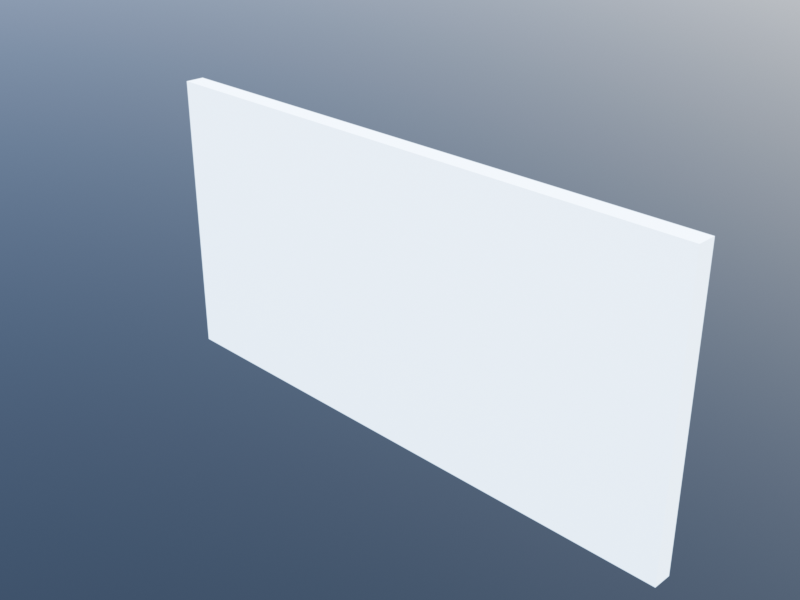
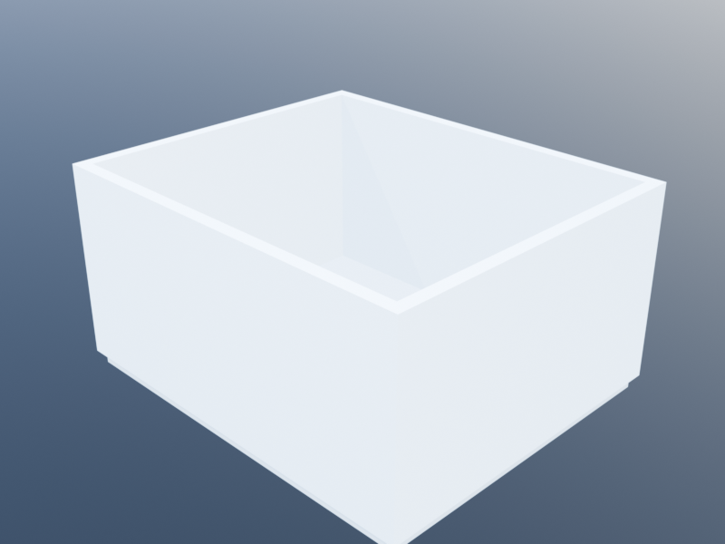
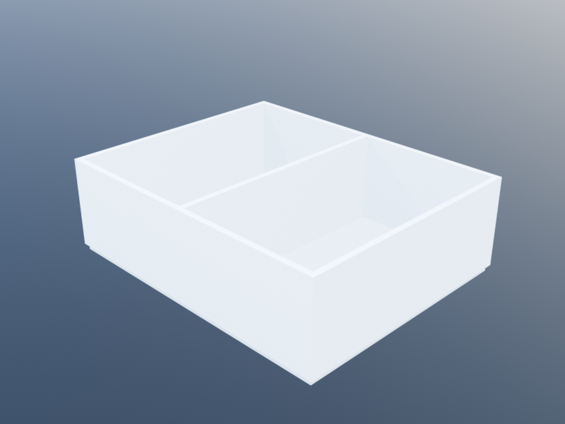
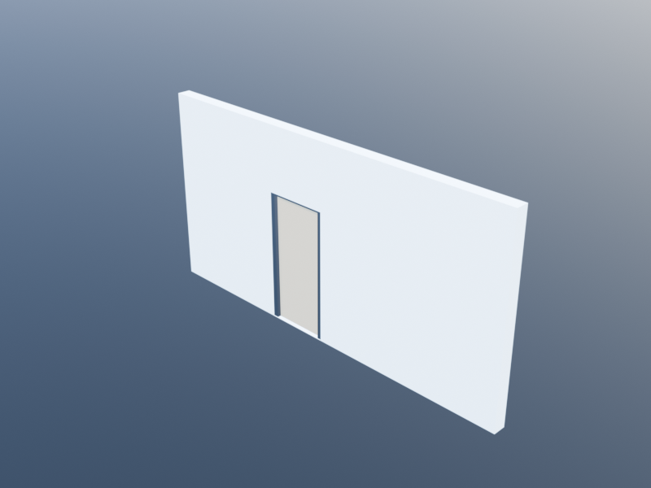
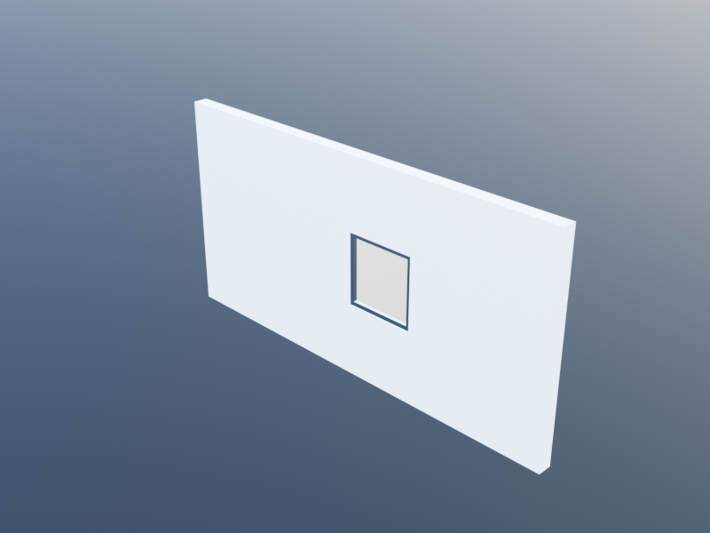

# Wall Graph Tutorial

Traditional wall creation in Khepri requires managing individual wall paths, manually computing door and window positions, and calling `join_walls` to merge adjacent walls. The **WallGraph** layer replaces this workflow: you describe a network of wall segments connected at junction points, and the system handles corner miters, T-junction geometry, and opening placement automatically.

This tutorial progresses from simple wall networks to complex floor plans, showing both the direct WallGraph API and its integration with the Spaces module.

Each of the steps below produces a progressively richer network:

| Step 1 — single wall | Step 2 — L-shape | Step 3 — T-junction |
|:---:|:---:|:---:|
|  |  |  |

| Step 4 — closed room | Step 5 — full house |
|:---:|:---:|
|  |  |

## Setup

```julia
using KhepriAutoCAD   # or any Khepri backend

delete_all_shapes()
```

## A First Wall Network

The simplest wall graph is a single straight wall between two junctions.

```julia
wg = wall_graph()

j1 = junction!(wg, xy(0, 0))
j2 = junction!(wg, xy(8, 0))
s1 = segment!(wg, j1, j2)

build_walls(wg)
```

`wall_graph()` creates an empty graph with default level and height. `junction!` adds points, `segment!` connects them, and `build_walls` generates the BIM geometry. The result is a single wall 8 meters long.

### Adding a Door

Openings are placed on segments by distance from junction_a.

```julia
wg = wall_graph()

j1 = junction!(wg, xy(0, 0))
j2 = junction!(wg, xy(8, 0))
s1 = segment!(wg, j1, j2)

add_wall_door!(wg, s1, at=3.0)

build_walls(wg)
```

The door is placed 3 meters from junction j1. If `at` is omitted, the door is centered on the segment.



### Adding Windows

Windows take an additional `sill` parameter for the height above the floor.

```julia
wg = wall_graph()

j1 = junction!(wg, xy(0, 0))
j2 = junction!(wg, xy(10, 0))
s1 = segment!(wg, j1, j2)

# Door centered
add_wall_door!(wg, s1)
# Window at 1m from j1, 0.9m sill height
add_wall_window!(wg, s1, at=1.0, sill=0.9,
  family=window_family(width=1.4, height=1.5))
# Window at 7m from j1
add_wall_window!(wg, s1, at=7.0, sill=0.9,
  family=window_family(width=1.4, height=1.5))

build_walls(wg)
```



## L-Corners and Chain Merging

When two segments meet at a junction with valence 2 (an "elbow"), they are automatically merged into a single wall path with a proper miter joint.

### Explicit Construction

```julia
wg = wall_graph()

j1 = junction!(wg, xy(0, 0))
j2 = junction!(wg, xy(8, 0))
j3 = junction!(wg, xy(8, 5))

segment!(wg, j1, j2)  # south wall
segment!(wg, j2, j3)  # east wall

result = build_walls(wg)
length(result.walls)  # => 1 (both segments merged into one wall)
```

Even though we defined two separate segments, the system merges them into a single wall with a 3-vertex path `[xy(0,0), xy(8,0), xy(8,5)]`. The miter at `xy(8,0)` is handled automatically by the existing wall offset geometry.

### Path-Based Construction

The `wall_path!` function is a convenient shorthand that creates junctions and segments from a list of points.

```julia
wg = wall_graph()
wall_path!(wg, xy(0,0), xy(8,0), xy(8,5))
build_walls(wg)
```

This produces the same L-corner wall as above, in one line.

### Closed Perimeters

Use `closed=true` to create a room perimeter.

```julia
wg = wall_graph()
wall_path!(wg, xy(0,0), xy(8,0), xy(8,5), xy(0,5), closed=true)
build_walls(wg)
```

All four walls merge into a single closed-path wall with properly mitered corners.

## T-Junctions

T-junctions occur when three wall segments meet at a junction. The system automatically identifies the collinear "through" pair and extends the abutting wall to meet the through-wall's face.

### Two Rooms with a Partition

```julia
wg = wall_graph()

# Exterior walls
wall_path!(wg, xy(0,0), xy(10,0), xy(10,5), xy(0,5), closed=true)
# Interior partition at x=5
wall_path!(wg, xy(5,0), xy(5,5))

result = build_walls(wg)
length(result.walls)  # => 2 (perimeter + partition)
```

The perimeter merges into a single closed-path wall. At `xy(5,0)` and `xy(5,5)`, the system recognizes T-junctions: the south and north walls are the "through" pair, the partition is the "abutting" wall. The partition's endpoints are extended by the perimeter wall's half-thickness so that it meets the perimeter's outer face cleanly.

### Adding a Door to the Partition

```julia
wg = wall_graph()

wall_path!(wg, xy(0,0), xy(10,0), xy(10,5), xy(0,5), closed=true)
segs = wall_path!(wg, xy(5,0), xy(5,5))

# Door centered on the partition wall
add_wall_door!(wg, segs[1])

result = build_walls(wg)
```

The door is placed on the partition segment. After chain merging and T-junction extension, the door position is adjusted to account for the partition's extended length.

## Cross Junctions

When four or more walls meet at a point, the system pairs them by collinearity. Each collinear pair forms a through-wall; non-collinear segments are abutting walls.

```julia
wg = wall_graph()

# Four walls meeting at xy(5, 5)
wall_path!(wg, xy(0,5), xy(10,5))  # horizontal through-wall
wall_path!(wg, xy(5,0), xy(5,10))  # vertical through-wall

result = build_walls(wg)
length(result.walls)  # => 2 (one horizontal, one vertical)
```

## Mixed Wall Families

Chain merging only groups segments with the same wall family and offset. When families differ, separate walls are created.

```julia
ext = wall_family(thickness=0.3)
int = wall_family(thickness=0.15)

wg = wall_graph()

# Thick exterior walls
wall_path!(wg, xy(0,0), xy(10,0), xy(10,8), xy(0,8), closed=true, family=ext)
# Thin interior partition
wall_path!(wg, xy(5,0), xy(5,8), family=int)

result = build_walls(wg)
length(result.walls)  # => 2 (exterior and interior have different families)
```

The T-junction extension at `xy(5,0)` uses the exterior wall's half-thickness (0.15m), so the partition extends the correct distance to meet the thick exterior wall's face.

## Building a House

Here is a complete example combining all features: a small house with five rooms, doors, and windows.

```julia
wg = wall_graph(height=2.8)

ext = wall_family(thickness=0.25)
int = wall_family(thickness=0.15)

# Exterior perimeter: 12m x 9m
wall_path!(wg, xy(0,0), xy(12,0), xy(12,9), xy(0,9), closed=true, family=ext)

# Interior partitions
s_ns = wall_path!(wg, xy(6,0), xy(6,5), family=int)        # living/kitchen divide
s_ew = wall_path!(wg, xy(0,5), xy(12,5), family=int)        # south/north corridor
s_bed = wall_path!(wg, xy(5,5), xy(5,9), family=int)        # bedroom divide

# Doors
add_wall_door!(wg, s_ns[1])                                   # living <-> kitchen
add_wall_door!(wg, s_ew[1], at=2.5)                           # living -> corridor
add_wall_door!(wg, s_ew[2], at=3.0)                           # kitchen -> corridor
add_wall_door!(wg, s_bed[1])                                   # bedroom <-> bedroom

# Windows on exterior walls (need to find the right segments)
# South wall segments: xy(0,0)->xy(6,0) and xy(6,0)->xy(12,0)
# These are part of the perimeter chain, so we place openings
# by junction pair.
j_origin = find_or_create_junction!(wg, xy(0,0), 0.01)
j_mid_s  = find_or_create_junction!(wg, xy(6,0), 0.01)
j_se     = find_or_create_junction!(wg, xy(12,0), 0.01)
j_ne     = find_or_create_junction!(wg, xy(12,9), 0.01)

add_wall_window!(wg, j_origin, j_mid_s, at=1.5,
  family=window_family(width=1.4, height=1.5))
add_wall_window!(wg, j_mid_s, j_se, at=1.5,
  family=window_family(width=1.4, height=1.5))

result = build_walls(wg)
println("Walls: $(length(result.walls))")
println("Doors: $(length(result.doors))")
println("Windows: $(length(result.windows))")
```

## Integration with Spaces

The Spaces module uses WallGraph internally. When you call `build(plan)`, the classified edge segments are fed into a wall graph, chains are resolved, and walls are created with proper junction geometry. This is fully automatic -- no WallGraph code is needed.

### Before: Individual Walls (Old Behavior)

Previously, `build(plan)` created one wall per edge segment. A simple two-room plan produced 7 individual walls (6 exterior edges + 1 interior), each with flat perpendicular caps. Corners overlapped or had gaps.

### After: Merged Chains (New Behavior)

Now, `build(plan)` produces merged walls with proper miters:

```julia
plan = floor_plan(height=2.8)

living = add_space(plan, "Living",
  closed_polygonal_path([xy(0,0), xy(6,0), xy(6,5), xy(0,5)]),
  kind=:room)
kitchen = add_space(plan, "Kitchen",
  closed_polygonal_path([xy(6,0), xy(10,0), xy(10,5), xy(6,5)]),
  kind=:kitchen)
corridor = add_space(plan, "Corridor",
  closed_polygonal_path([xy(0,5), xy(10,5), xy(10,6.2), xy(0,6.2)]),
  kind=:corridor)
bedroom = add_space(plan, "Bedroom",
  closed_polygonal_path([xy(0,6.2), xy(5,6.2), xy(5,10), xy(0,10)]),
  kind=:bedroom)
wc = add_space(plan, "WC",
  closed_polygonal_path([xy(5,6.2), xy(10,6.2), xy(10,10), xy(5,10)]),
  kind=:wc)

add_door(plan, living, corridor)
add_door(plan, kitchen, corridor)
add_door(plan, bedroom, corridor)
add_door(plan, wc, corridor)
add_door(plan, living, kitchen)
add_door(plan, living, :exterior, loc=xy(3, 0))   # front door on south facade

large_win = window_family(width=1.4, height=1.5)
add_window(plan, living, :exterior, loc=xy(3, 0), family=large_win)
add_window(plan, kitchen, :exterior, loc=xy(8, 0), family=large_win)
add_window(plan, bedroom, :exterior, loc=xy(2.5, 10), family=large_win)

result = build(plan)
println(result)
# BuildResult(5 spaces, 5 walls, 5 doors, 3 windows, 5 slabs, 35 boundaries)
```

With the old approach this would have produced 16 walls. Now it produces 5 merged walls with clean corners. All Spaces features -- boundary introspection, validation rules, adjacency queries -- continue to work exactly as before.

```julia
# Introspection still works
println("Living walls: ", length(space_walls(result, living)))
println("Living doors: ", length(space_doors(result, living)))
println("Corridor adjacent: ", join([s.name for s in adjacent_spaces(result, corridor)], ", "))
```

## Choosing Between WallGraph and Spaces

Use the approach that best fits your workflow:

| | **WallGraph** (direct) | **Spaces** (space-first) |
|---|---|---|
| **You think in terms of...** | Walls, corners, segments | Rooms, connections, boundaries |
| **Best for** | Precise wall layouts, partial walls, mixed families | Floor plans, room-based design, building regulations |
| **Junction geometry** | You control exactly which walls connect | Automatic from polygon adjacency |
| **Validation** | Not built in | Min/max area rules, door/window requirements |
| **Boundary introspection** | Not built in | Full IFC-aligned boundary model |

Both approaches produce the same underlying `wall`, `door`, and `window` BIM objects and are backend-portable.

## API Reference

| Function | Description |
|----------|-------------|
| `wall_graph(; level, height)` | Create an empty wall graph |
| `junction!(wg, position)` | Add a junction, returns index |
| `segment!(wg, j_a, j_b; family, offset)` | Add a segment, returns index |
| `wall_path!(wg, points...; closed, family, offset)` | Add junctions + segments from points |
| `add_wall_door!(wg, seg; at, family)` | Place a door on a segment |
| `add_wall_door!(wg, j_a, j_b; at, family)` | Place a door by junction pair |
| `add_wall_window!(wg, seg; at, sill, family)` | Place a window on a segment |
| `add_wall_window!(wg, j_a, j_b; at, sill, family)` | Place a window by junction pair |
| `resolve(wg)` | Resolve chains, returns `Vector{ResolvedChain}` |
| `build_walls(wg)` | Build BIM objects, returns `(walls, doors, windows)` |
| `segment_length(wg, seg_idx)` | Length of a segment in meters |
| `find_or_create_junction!(wg, pos, tol)` | Find or create a junction at a position |

For the full type and function reference, see [Wall Graph Reference](../bim/wall_graph.md).
